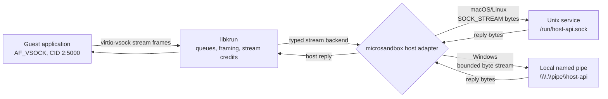
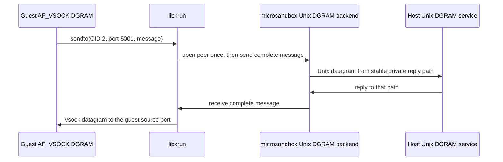

Virtio-vsock provides local guest-to-host communication without IP networking, TSI interception, SSH forwarding, or an agentd proxy. A guest application opens an `AF_VSOCK` socket and addresses host CID `2` plus the configured port. Microsandbox connects that route to one explicit local endpoint: a Unix socket on macOS or Linux, or a local named pipe on Windows.

```bash
# SOCK_STREAM is the default.
msb run --vsock /run/host-api.sock:5000 alpine

# The suffix can be explicit; repeat the flag for more routes.
msb run \
  --vsock /run/host-api.sock:5000/stream \
  --vsock /run/events.sock:5001/dgram \
  alpine
```

On Windows, the same flag and SDK method take a local named-pipe path. Stream routes are supported; `/dgram` remains Unix-only.

```powershell
msb run --vsock '\\.\pipe\host-api:5000' alpine
```

The path comes first, like the host side of `--port`; the number is the host-CID vsock port visible to the guest. Unlike `--port`, this is not a TCP or UDP mapping and there is no guest IP port. `/stream` and `/dgram` select vsock socket semantics. The same numeric port may be used once for each socket type because stream and datagram namespaces are distinct.



For Unix-host datagrams, libkrun identifies a peer by `(guest CID, guest source port, host port)`. Microsandbox creates a private, stable Unix datagram reply address for that peer, preserving message boundaries in both directions. Delivery is best-effort: backpressure may drop a datagram, and messages larger than 64 KiB are dropped rather than split. A host service can reply after it receives the guest's first message; this API does not initiate a new guest peer from the host. Windows rejects datagram routes because this implementation does not emulate messages over named pipes.

Virtio-vsock datagrams are not yet supported by stock Linux virtio-vsock drivers. Microsandbox supports them through the datagram feature already carried by its bundled libkrunfw guest kernel, so `/dgram` is specific to the microsandbox guest stack rather than a portable expectation for arbitrary kernels.



## SDK APIs

The compact API means stream in every SDK and accepts either platform's local path syntax. Use the explicit datagram variant on macOS or Linux when message boundaries matter.

```rust Rust
let sandbox = Sandbox::builder("worker")
    .image("alpine")
    .vsock("/run/host-api.sock", 5000)
    .vsock_dgram("/run/events.sock", 5001)
    .create()
    .await?;
```

```typescript TypeScript
const sandbox = await Sandbox.builder("worker")
  .image("alpine")
  .vsock("/run/host-api.sock", 5000)
  .vsockDgram("/run/events.sock", 5001)
  .create();
```

```python Python
from microsandbox import Sandbox, VsockRoute

# Mapping form is stream shorthand. Use VsockRoute for mixed socket types.
sandbox = await Sandbox.create(
    "worker",
    image="alpine",
    vsock=[
        VsockRoute.stream("/run/host-api.sock", 5000),
        VsockRoute.dgram("/run/events.sock", 5001),
    ],
)
```

```go Go
sandbox, err := microsandbox.CreateSandbox(ctx, "worker",
    microsandbox.WithImage("alpine"),
    microsandbox.WithVsock(
        microsandbox.VsockRoute{HostSocket: "/run/host-api.sock", Port: 5000},
        microsandbox.VsockRoute{HostSocket: "/run/events.sock", Port: 5001, SocketType: microsandbox.VsockSocketTypeDgram},
    ),
)
```

```ruby Ruby
sandbox = Microsandbox::Sandbox.builder("worker")
  .image("alpine")
  .vsock("/run/host-api.sock", 5000)
  .vsock_dgram("/run/events.sock", 5001)
  .create
```

## Security model and limits

Vsock itself is a transport, not an authorization boundary. A route grants the guest whatever authority the selected host service grants to the `msb` process. Exposing a Docker socket, SSH agent, package-manager daemon, or privileged control API can therefore amount to host code execution or credential use even though the guest cannot read the socket path directly.

Microsandbox limits this surface deliberately:

- Routes are explicit, local-only creation settings. Unix hosts require absolute socket paths; Windows accepts only `\\.\pipe\...` and rejects remote `\\server\pipe\...` names.
- Multi-tenant deployments reject host vsock routes. Cloud backends reject the unsupported setting instead of dropping it.
- Unix adapters use nonblocking descriptors. The Windows adapter keeps blocking pipe I/O on a cancellable worker, exposes only bounded nonblocking queues to libkrun, and opens pipes with identification-only security QoS so the server cannot impersonate the client through this connection. Guest teardown cancels a worker blocked by a pipe server that stopped consuming data. Every route caps active stream connections or datagram peers at 256.
- Datagram port `123` is reserved for libkrun's guest clock synchronization. Port `0` and `u32::MAX` are invalid.
- Host filesystem or named-pipe ACLs still apply using the credentials of the `msb` process, but those permissions do not make a powerful service safe to expose.
- Agentd does not create or manage these ports, and enabling a route does not enable TSI or IP networking.

Use a narrowly scoped host service with its own authentication and request validation. Treat each route as an intentional capability granted to every process that can open the configured vsock port inside the guest.
