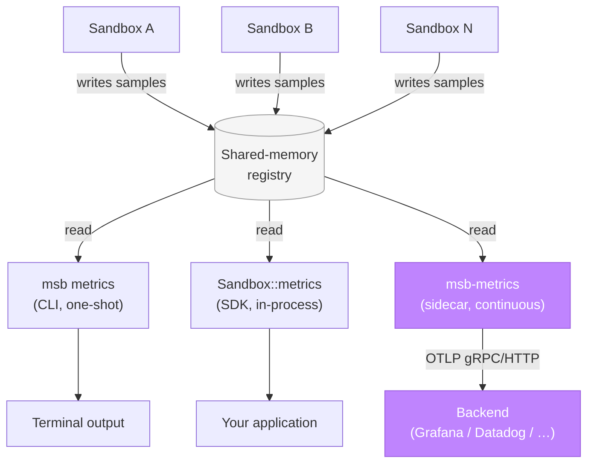

`msb-metrics` is a sibling process. It reads the microsandbox
shared-memory metrics registry on a fixed interval and ships
per-sandbox metrics to any OpenTelemetry-compatible backend.

Think of it the way you'd run `otel-collector`,
`prometheus-node-exporter`, or `fluent-bit`: one process per host,
lifecycle managed independently.

It's one of three ways to read sandbox metrics. For one-shot
inspection from the terminal, use the
[`msb metrics`](/cli/sandbox-commands#msb-metrics) CLI command. For
programmatic per-sandbox reads from application code, use
[`Sandbox::metrics()`](/sandboxes/metrics). All three read the same
shared-memory registry and can coexist; the diagram below shows how
they relate.

## Where it fits



Three surfaces read the same shared-memory registry. This page is
about the highlighted path: a continuous push to an OTel-compatible
backend.

## Quick start

<Steps>
  <Step title="Run msb-metrics against a local OTLP receiver">
    ```sh
    msb-metrics otel --endpoint=http://localhost:4317
    ```
  </Step>
  <Step title="Boot a sandbox">
    ```sh
    msb run alpine
    ```
  </Step>
  <Step title="Watch metrics flow">
    The collector polls shared memory every second, batches per-exporter,
    and ships over OTLP. Press Ctrl+C to drain buffers and exit cleanly.
  </Step>
</Steps>

## Pick your backend

End-to-end setup walkthroughs live under [Recipes](/recipes):

<CardGroup cols={2}>
  <Card title="Grafana Cloud" icon="cloud-arrow-up" href="/recipes/metrics-shipping/grafana-cloud">
    Direct OTLP to Grafana Cloud's gateway.
  </Card>
  <Card title="Grafana Alloy" icon="route" href="/recipes/metrics-shipping/grafana-alloy">
    Local Alloy as a forwarder. Recommended for production.
  </Card>
  <Card title="otel-collector" icon="terminal" href="/recipes/metrics-shipping/otel-collector">
    Local development with the OpenTelemetry Collector.
  </Card>
  <Card title="Datadog" icon="chart-line" href="/recipes/metrics-shipping/datadog">
    Via the Datadog Agent's OTLP receiver.
  </Card>
</CardGroup>

## Going deeper

For flags, metric names, attribute tables, operational notes, and
troubleshooting, see [Configuration](/observability/configuration).

## See also

- [Configuration](/observability/configuration): full flag reference,
  emitted metrics, attributes, operations, troubleshooting.
- [`Sandbox::metrics()`](/sandboxes/metrics): read metrics for a single
  sandbox from application code, an alternative to shipping via OTLP.
- [`msb metrics`](/cli/sandbox-commands#msb-metrics): one-shot CLI
  inspection of current per-sandbox metrics.
