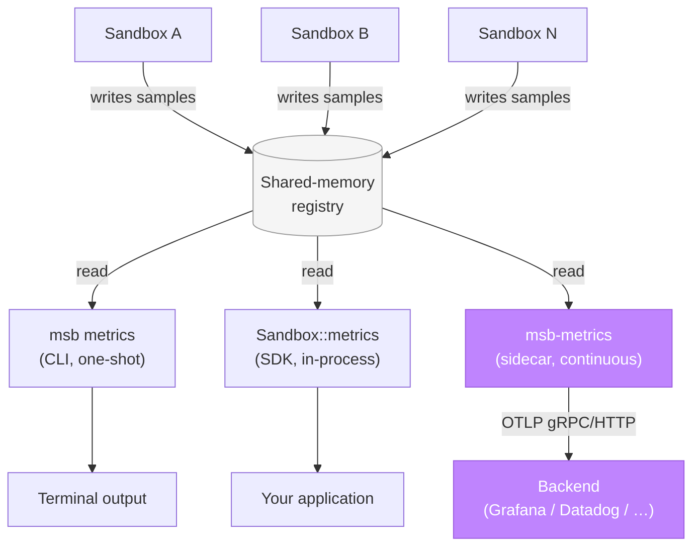

`msb-metrics` is a sibling process. It reads the microsandbox
shared-memory metrics registry on a fixed interval and ships
per-sandbox metrics to any OpenTelemetry-compatible backend.

Think of it the way you'd run
[`otel-collector`](https://opentelemetry.io/docs/collector/),
[`prometheus-node-exporter`](https://github.com/prometheus/node_exporter),
or [`fluent-bit`](https://docs.fluentbit.io/): one process per host,
lifecycle managed independently.

It's one of three ways to read sandbox metrics. For one-shot
inspection from the terminal, use the
[`msb metrics`](/cli/sandbox-commands#msb-metrics) CLI command. For
programmatic per-sandbox reads from application code, use
[`Sandbox::metrics()`](/sandboxes/metrics). All three read the same
shared-memory registry and can coexist; the diagram below shows how
they relate.

## Where it fits



Three surfaces read the same shared-memory registry. This page is
about the highlighted path: a continuous push to an OTel-compatible
backend.

## Install

`msb-metrics` is shipped as a standalone binary and is **not** bundled
with the [main `msb` installer](/getting-started/quickstart). Download
the build for your platform from the
[latest release](https://github.com/superradcompany/microsandbox/releases/latest)
and place it on your `PATH`.

## Quick start

<Steps>
  <Step title="Run msb-metrics against a local OTLP receiver">
    <Tabs>
      <Tab title="gRPC (default)">
        Default port `4317`. Recommended for most local OTLP collectors
        and sidecars.

        ```sh
        msb-metrics otel --endpoint=http://localhost:4317
        ```
      </Tab>
      <Tab title="HTTP/Protobuf">
        Default port `4318`. Use when the backend's gRPC port isn't
        reachable, or when the gateway expects HTTP (e.g. Grafana
        Cloud's OTLP gateway over HTTPS).

        ```sh
        msb-metrics otel --endpoint=https://example.com/otlp/v1/metrics --protocol=http
        ```
      </Tab>
    </Tabs>
  </Step>
  <Step title="Boot a sandbox">
    ```sh
    msb run alpine
    ```
  </Step>
  <Step title="Watch metrics flow">
    The collector polls shared memory every second, batches per-exporter,
    and ships over OTLP. Press Ctrl+C to drain buffers and exit cleanly.
  </Step>
</Steps>

## Pick your backend

End-to-end setup walkthroughs live under [Recipes](/recipes):

<CardGroup cols={2}>
  <Card title="Grafana Cloud" icon="cloud-arrow-up" href="/recipes/metrics-backends/grafana-cloud">
    Direct OTLP to Grafana Cloud's gateway.
  </Card>
  <Card title="Grafana Alloy" icon="route" href="/recipes/metrics-backends/grafana-alloy">
    Local Alloy as a forwarder. Recommended for production.
  </Card>
  <Card title="Prometheus" icon="fire" href="/recipes/metrics-backends/prometheus">
    Direct OTLP to Prometheus's native receiver.
  </Card>
  <Card title="otel-collector" icon="terminal" href="/recipes/metrics-backends/otel-collector">
    Local development with the OpenTelemetry Collector.
  </Card>
  <Card title="Datadog" icon="chart-line" href="/recipes/metrics-backends/datadog">
    Via the Datadog Agent's OTLP receiver.
  </Card>
</CardGroup>

## Going deeper

For flags, metric names, attribute tables, operational notes, and
troubleshooting, see the [Deep dive](/observability/deep-dive).

## See also

- [Deep dive](/observability/deep-dive): full flag reference, emitted
  metrics, attributes, operations, troubleshooting.
- [`Sandbox::metrics()`](/sandboxes/metrics): read metrics for a single
  sandbox from application code, an alternative to shipping via OTLP.
- [`msb metrics`](/cli/sandbox-commands#msb-metrics): one-shot CLI
  inspection of current per-sandbox metrics.
