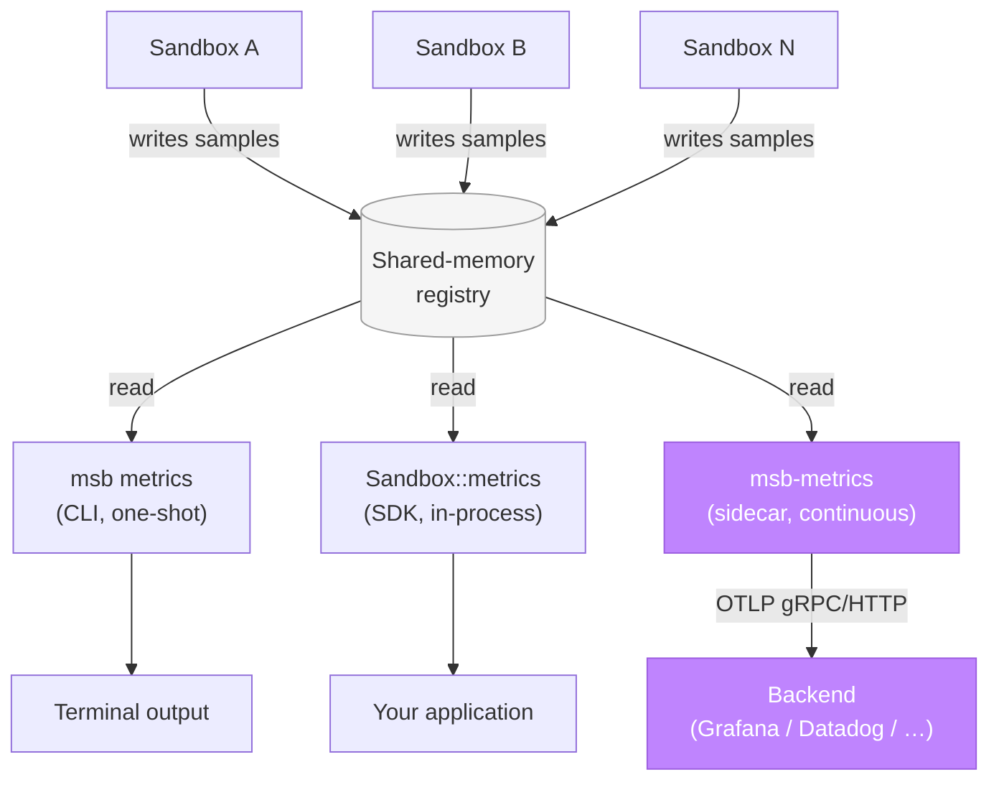

<Note>
There are three ways to read sandbox metrics in microsandbox. This page is about **`msb-metrics`**, the sidecar binary that ships metrics to observability backends over OTLP.

For one-shot inspection from the terminal, use the [`msb metrics`](/cli/sandbox-commands#msb-metrics) CLI command. For programmatic per-sandbox reads from application code, use [`Sandbox::metrics()`](/sandboxes/metrics). All three read the same shared-memory registry and can coexist.
</Note>

`msb-metrics` is a sibling process. It reads the microsandbox
shared-memory metrics registry on a fixed interval and ships
per-sandbox metrics to any OpenTelemetry-compatible backend.

Think of it the way you'd run `otel-collector`,
`prometheus-node-exporter`, or `fluent-bit`: one process per host,
lifecycle managed independently.

## Where it fits



Three surfaces read the same shared-memory registry. This page is
about the highlighted path: a continuous push to an OTel-compatible
backend.

## Quick start

<Steps>
  <Step title="Run msb-metrics against a local OTLP receiver">
    ```sh
    msb-metrics otel --endpoint=http://localhost:4317
    ```
  </Step>
  <Step title="Boot a sandbox">
    ```sh
    msb run alpine
    ```
  </Step>
  <Step title="Watch metrics flow">
    The collector polls shared memory every second, batches per-exporter,
    and ships over OTLP. Press Ctrl+C to drain buffers and exit cleanly.
  </Step>
</Steps>

## Pick your backend

End-to-end setup walkthroughs live under [Recipes](/recipes):

<CardGroup cols={2}>
  <Card title="Grafana Cloud" icon="cloud-arrow-up" href="/recipes/metrics-shipping/grafana-cloud">
    Direct OTLP to Grafana Cloud's gateway.
  </Card>
  <Card title="Grafana Alloy" icon="route" href="/recipes/metrics-shipping/grafana-alloy">
    Local Alloy as a forwarder. Recommended for production.
  </Card>
  <Card title="otel-collector" icon="terminal" href="/recipes/metrics-shipping/otel-collector">
    Local development with the OpenTelemetry Collector.
  </Card>
  <Card title="Datadog" icon="chart-line" href="/recipes/metrics-shipping/datadog">
    Via the Datadog Agent's OTLP receiver.
  </Card>
</CardGroup>

## Deployment constraints

<Warning>
`msb-metrics` reads the shm registry directly. Two constraints follow:

- **Same Unix user as `msb`.** The shm object is mode `0600` (owner
  read/write only). Running `msb-metrics` as a different user produces
  `EACCES` on attach.
- **Same `$MSB_HOME`.** The shm name is derived from
  `stable_hash($MSB_HOME)`, so both processes must agree on it. Pass
  `--msb-home` explicitly if your environment doesn't set `$MSB_HOME`;
  the default is `~/.microsandbox`.

The registry is per-host. One `msb-metrics` process per host covers
every running sandbox there.
</Warning>

## Metrics emitted

All metrics are namespaced under `microsandbox.*` so they don't collide
with OTel semantic-convention `system.*` host metrics in the same
backend tenant.

| Metric | Type | Unit | Notes |
|---|---|---|---|
| `microsandbox.cpu.utilization` | gauge | `1` (0.0–1.0) | Source is 0–100 percent; divided by 100 on emit. |
| `microsandbox.memory.usage` | gauge | `By` | Resident memory in bytes. |
| `microsandbox.memory.limit` | gauge | `By` | Configured guest memory limit. |
| `microsandbox.disk.bytes_read` | gauge | `By` | Cumulative bytes read by the sandbox process. |
| `microsandbox.disk.bytes_written` | gauge | `By` | Cumulative bytes written. |
| `microsandbox.network.bytes_received` | gauge | `By` | Cumulative bytes from runtime to guest. |
| `microsandbox.network.bytes_sent` | gauge | `By` | Cumulative bytes from guest to runtime. |
| `microsandbox.uptime` | gauge | `s` | Sandbox uptime at sample time. |

Cumulative byte fields are emitted as gauges carrying the absolute
cumulative value. Use `rate()` (PromQL, OTel-flavored Prom) for
throughput. The reason: each shm snapshot already carries an absolute
value, and counter `add()` semantics would require us to track
per-sandbox deltas across runs.

## Transport

<Tabs>
  <Tab title="gRPC (default)">
    Default port `4317`. Recommended for most local OTLP collectors and
    sidecars.

    ```sh
    msb-metrics otel --endpoint=http://localhost:4317 --protocol=grpc
    ```
  </Tab>
  <Tab title="HTTP/Protobuf">
    Default port `4318`. Use when the backend's gRPC port isn't
    reachable, or when the gateway expects HTTP (e.g. Grafana Cloud's
    OTLP gateway over HTTPS).

    ```sh
    msb-metrics otel --endpoint=https://example.com/otlp --protocol=http
    ```
  </Tab>
</Tabs>

## Attributes

Every datapoint carries a configurable set of attributes.

**Resource attributes** describe the source. Defaults are set
automatically; `--resource KEY=VALUE` overrides or adds.

| Key | Default |
|---|---|
| `service.name` | `microsandbox` |
| `service.instance.id` | hostname, best-effort from `HOSTNAME` / `COMPUTERNAME` |

**Identity attributes** describe which sandbox a datapoint belongs to.
`run_id` and `pid` are opt-in because they create a fresh time series
per sandbox restart, which inflates active-series counts on
cardinality-billed backends.

| Attribute | Default | Notes |
|---|---|---|
| `sandbox.name` | on | Low cardinality. |
| `sandbox.id` | on | Catalog id; low cardinality. |
| `sandbox.run_id` | off | Opt-in via `--emit-run-id`. Fresh series per restart. |
| `sandbox.pid` | off | Opt-in via `--emit-pid`. Fresh series per restart. |

## All flags

<Accordion title="msb-metrics otel">
```text
msb-metrics otel --endpoint=<URL>
                 [--protocol=grpc|http]
                 [--header=KEY=VALUE]...
                 [--resource=KEY=VALUE]...
                 [--emit-run-id] [--emit-pid]
                 [--collect-interval=<dur>]
                 [--flush-interval=<dur>]
                 [--max-buffered=<n>]
                 [--export-timeout=<dur>]
                 [--msb-home=<path>]
```

| Flag | Default | Notes |
|---|---|---|
| `--endpoint` | (required) | OTLP endpoint URL. |
| `--protocol` | `grpc` | `grpc` (port `4317`) or `http` (Protobuf body, port `4318`). |
| `--header` | none | `KEY=VALUE`, repeatable. For auth (`Authorization`, `api-key`, etc.). Applied via `OTEL_EXPORTER_OTLP_HEADERS`. |
| `--resource` | none | `KEY=VALUE`, repeatable. Overrides or adds OTel resource attributes. |
| `--emit-run-id` | off | Add `sandbox.run_id` to every datapoint. Opt-in: high cardinality. |
| `--emit-pid` | off | Add `sandbox.pid` to every datapoint. Opt-in: high cardinality. |
| `--collect-interval` | `1s` | How often shm is read. `humantime` durations (`1s`, `500ms`, `2m`). |
| `--flush-interval` | `10s` | Per-exporter scheduled flush cadence. |
| `--max-buffered` | `60` | Per-exporter buffer cap. Oldest collection drops on overflow; drop count surfaces on the next batch. |
| `--export-timeout` | `30s` | Per-call timeout for a single OTLP export. |
| `--msb-home` | `$MSB_HOME` ∨ `~/.microsandbox` | Used to derive the shm registry name. |
</Accordion>

<Accordion title="Global flags">
| Flag | Default | Notes |
|---|---|---|
| `--log-level` | `info` | `error`, `warn`, `info`, `debug`, `trace`. `RUST_LOG` env var wins if set. |
</Accordion>

Or just run `msb-metrics otel --help` for the full prose.

## Run under systemd

```ini
# /etc/systemd/system/msb-metrics.service
[Unit]
Description=microsandbox metrics collector
After=network-online.target

[Service]
Type=simple
User=msb                                       # same user that runs msb
Environment=MSB_HOME=/var/lib/microsandbox
ExecStart=/usr/local/bin/msb-metrics otel \
          --endpoint=http://localhost:4317
Restart=on-failure
RestartSec=5s

[Install]
WantedBy=multi-user.target
```

Systemd sends SIGTERM on `systemctl stop`; the collector drains
buffers, calls each exporter's `shutdown()`, and exits cleanly.

## Tuning at scale

With ~1000 sandboxes per host:

- Heap is dominated by the per-exporter buffer. At 1000 sandboxes with
  the default `--max-buffered=60`, worst-case heap when the backend is
  slow is roughly `60 × 1000 × ~350B ≈ 21 MB` per exporter. Drop
  `--max-buffered` to `~20` if you want a tighter cap.
- The shm registry itself is fixed at ~512 KiB regardless of active
  count.
- No sqlite read is on the hot path; `msb-metrics` is pure-shm.

## Shutdown behavior

SIGINT or SIGTERM triggers a clean drain:

1. Stop the collect ticker.
2. Push any buffered collections through one final export.
3. Call each exporter's `shutdown()` (OTel: flushes and closes the
   OTLP transport).
4. Exit.

If an exporter's final export hangs, it's bounded by
`--export-timeout`.

## Backend unreachable

Failed exports are retried on the next flush; the failed batch is
restored to the front of the buffer. If failures keep arriving, oldest
collections drop first and the next successful export's
`droppedCollectionCount` reports how many were lost. The collector
itself does not crash.

## Troubleshooting

<AccordionGroup>
  <Accordion title="EACCES opening the shm region">
    You're running `msb-metrics` as a different Unix user from the one
    that owns the registry. Switch users or use `sudo -u <msb-user>`.
  </Accordion>

  <Accordion title="Empty metrics, no sandboxes show up">
    Either no sandboxes are running, or `msb-metrics` is reading a
    different registry than `msb` writes. Check `--msb-home` matches
    the runtime's `$MSB_HOME`. Use `--log-level=debug` to see the
    registry name and collect cadence.
  </Accordion>

  <Accordion title="OTLP backend rejects the request (HTTP 401/403/422)">
    Auth or schema mismatch. Verify the `--header` value (especially
    `Authorization` base64 encoding) and that the endpoint URL matches
    the protocol. gRPC endpoints typically end at `4317`, HTTP/Protobuf
    at `4318` with an explicit `/v1/metrics` path on some backends.
  </Accordion>

  <Accordion title="Sandbox restarts produce fresh time series">
    Expected if `--emit-run-id` or `--emit-pid` is on. Drop them if you
    want a single series per sandbox name across restarts.
  </Accordion>
</AccordionGroup>

## See also

- [`Sandbox::metrics()`](/sandboxes/metrics): read metrics for a single
  sandbox from application code, an alternative to shipping via OTLP.
- [`msb metrics`](/cli/sandbox-commands#msb-metrics): one-shot CLI
  inspection of current per-sandbox metrics.
