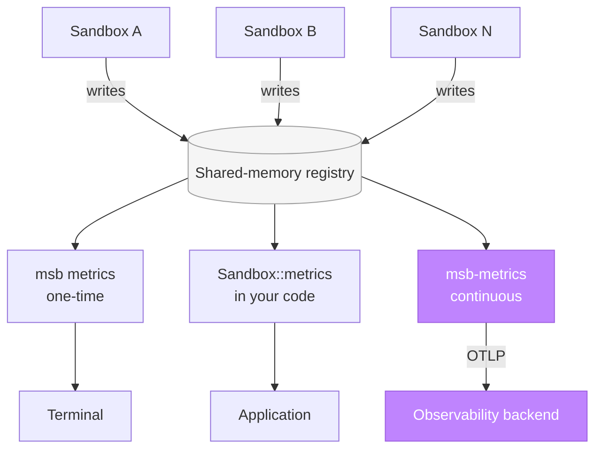

<Tooltip tip="msb-metrics reads host-local shared memory, so it applies to the local runtime and self-hosted deployments only."><span className="msb-badge-local">Local-only <Icon icon="circle-info" size={11} /></span></Tooltip>

`msb-metrics` is a separate binary that continuously exports sandbox CPU,
memory, disk, and network metrics to an OpenTelemetry-compatible backend.
Run one collector on each host alongside microsandbox.

For a one-time reading, use [`msb metrics`](/cli/sandbox-commands#msb-metrics).
To read metrics in application code, use
[`Sandbox::metrics()`](/sandboxes/metrics).

## How it works


```mermaid
flowchart TD
    classDef store fill:#f5f5f5,stroke:#9d9d9d,color:#333
    classDef thispage fill:#bf84fe,color:#fff,stroke:#9d5fe0

    SB1[Sandbox A]
    SB2[Sandbox B]
    SB3[Sandbox N]
    SB1 -->|writes| SHM
    SB2 -->|writes| SHM
    SB3 -->|writes| SHM
    SHM[(Shared-memory registry)]:::store

    SHM --> CLI["msb metrics<br/>one-time"]
    SHM --> SDK["Sandbox::metrics<br/>in your code"]
    SHM --> MSB["msb-metrics<br/>continuous"]:::thispage

    CLI --> TERM[Terminal]
    SDK --> APP[Application]
    MSB -->|OTLP| BACKEND[Observability backend]:::thispage
```

All three interfaces read the same host-local registry and can run together.
This page covers continuous export with `msb-metrics`.

## Setup

### Install

`msb-metrics` is not included with the
[main `msb` installer](/getting-started/quickstart). Download it from the
[latest release](https://github.com/superradcompany/microsandbox/releases/latest)
and place it on your `PATH`.

### Requirements

The collector reads the shared-memory registry directly:

- Run it as the **same Unix user** as `msb`. The registry is owner-only.
- Use the **same `$MSB_HOME`** as `msb`. If needed, pass `--msb-home`; the
  default is `~/.microsandbox`.
- Run **one collector per host**. Each registry contains only that host's
  sandboxes.

### Quick start

<Steps>
  <Step title="Start the collector">
    <Tabs>
      <Tab title="gRPC">
        Use port `4317` for most local collectors and sidecars.

        ```sh
        msb-metrics otel --endpoint=http://localhost:4317
        ```
      </Tab>
      <Tab title="HTTP">
        Use a complete metrics endpoint, commonly on port `4318`.

        ```sh
        msb-metrics otel --endpoint=https://example.com/otlp/v1/metrics --protocol=http
        ```
      </Tab>
    </Tabs>
  </Step>
  <Step title="Run a sandbox">
    ```sh
    msb run alpine
    ```
  </Step>
  <Step title="Check your backend">
    Metrics appear after the next collection and export intervals.
  </Step>
</Steps>

### Backends

For production, we recommend using Grafana Alloy or another local collector
as a forwarder. You can also export directly to a hosted backend.

End-to-end setup walkthroughs live under [Examples](/examples/overview):

<CardGroup cols={2}>
  <Card title="Grafana Alloy" icon="route" href="/examples/metrics-backends/grafana-alloy">
    Forward metrics through a local Alloy process.
  </Card>
  <Card title="Grafana Cloud" icon="cloud-arrow-up" href="/examples/metrics-backends/grafana-cloud">
    Export directly to Grafana Cloud.
  </Card>
  <Card title="Prometheus" icon="fire" href="/examples/metrics-backends/prometheus">
    Use Prometheus's native OTLP receiver.
  </Card>
  <Card title="OpenTelemetry Collector" icon="terminal" href="/examples/metrics-backends/otel-collector">
    Run a local OpenTelemetry Collector.
  </Card>
  <Card title="Datadog" icon="chart-line" href="/examples/metrics-backends/datadog">
    Export through the Datadog Agent.
  </Card>
</CardGroup>

## Metrics

### Sandbox metrics

Metrics use the `microsandbox.*` namespace. The table shows only the suffix.

| Suffix | Unit | Description |
| --- | --- | --- |
| `cpu.utilization` | `1` | vCPU-seconds per wall-second. A fully used 2-vCPU sandbox reports `2.0`. |
| `memory.usage` | `By` | Resident memory. |
| `memory.limit` | `By` | Configured guest memory limit. |
| `disk.bytes_read` | `By` | Cumulative bytes read by the sandbox process. |
| `disk.bytes_written` | `By` | Cumulative bytes written. |
| `network.bytes_received` | `By` | Cumulative bytes from runtime to guest. |
| `network.bytes_sent` | `By` | Cumulative bytes from guest to runtime. |
| `upper.used` | `By` | Used space on the OCI upper filesystem when reporting is available. |
| `upper.free` | `By` | Available space on the OCI upper filesystem when reporting is available. |
| `upper.host_allocated` | `By` | Host-allocated space for the writable upper image when observable. |
| `uptime` | `s` | Sandbox uptime. |

Disk and network totals are gauges containing absolute cumulative values. Use
`rate()` in PromQL for throughput.

### Attributes

Every datapoint identifies its source and sandbox.

| Attribute | Default | Description |
| --- | --- | --- |
| `service.name` | `microsandbox` | Service resource attribute. Override with `--resource`. |
| `service.instance.id` | Hostname | Host identity, when available. Override with `--resource`. |
| `sandbox.name` | on | Sandbox name. |
| `sandbox.id` | on | Sandbox catalog ID. |
| `sandbox.run_id` | off | Enable with `--emit-run-id`; creates a series after every restart. |
| `sandbox.pid` | off | Enable with `--emit-pid`; creates a series after every restart. |

[Sandbox labels](/sandboxes/labels) are also included by default. Disable all
labels with `--no-labels`, or repeat `--exclude-label-key <key>` to omit
specific keys from metrics without removing them from the sandbox catalog.

<Warning>
  High-cardinality labels such as `user.id`, `sandbox.run_id`, and
  `sandbox.pid` can increase active-series counts and backend costs. Include
  only the dimensions you query.
</Warning>

Label lookup is best-effort. If the catalog is unavailable, the collector
exports that sample without labels and tries again on the next interval.

### Labels in queries

Prometheus replaces dots in OpenTelemetry names with underscores. For example,
`user.id` becomes `user_id`, and `microsandbox.cpu.utilization` becomes
`microsandbox_cpu_utilization`.

```promql
# CPU by user
sum by (user_id) (microsandbox_cpu_utilization)

# One user's sandboxes
microsandbox_cpu_utilization{user_id="alice"}

# CPU by user in one tenant
sum by (user_id) (microsandbox_cpu_utilization{tenant="acme"})
```

### Restarts and stops

Disk and network totals reset when a sandbox restarts. PromQL `rate()` handles
these resets, though a brief negative interval can appear before the next
sample.

Stopped sandboxes stop producing samples, so their series become stale. A
crashed sandbox behaves the same way: readers retire its abandoned registry
entry on the next collection. See [Sandbox metrics](/sandboxes/metrics) for
the underlying lifecycle behavior.

## Operations

### Collector health

The collector exports its own health metrics through the same OTLP pipeline.

| Suffix | Type | Description |
| --- | --- | --- |
| `collector.exports.success` | counter | Successful exports since startup. |
| `collector.exports.failure` | counter | Failed exports since startup. |
| `collector.collections.dropped` | counter | Collections dropped because the buffer was full. |
| `collector.last_success_timestamp` | gauge | Unix time of the latest successful export. |

All use the OTel scope `microsandbox-metrics-collector`.

**Exports are flowing**

```promql
rate(microsandbox_collector_exports_success_total[1m])
```

**Export failure ratio**

```promql
rate(microsandbox_collector_exports_failure_total[5m])
  /
clamp_min(
  rate(microsandbox_collector_exports_success_total[5m]) +
  rate(microsandbox_collector_exports_failure_total[5m]),
  1
)
```

**No successful export for five minutes**

```promql
time() - microsandbox_collector_last_success_timestamp_seconds > 300
```

### Outages and retries

Failed exports return to the front of the buffer and retry with capped
exponential backoff, from `--flush-interval` up to 32 times that interval.
Oldest collections are dropped when the buffer fills. The collector reports
the loss through `collector.collections.dropped` and continues running.

### Scaling

The registry remains about 512 KiB regardless of sandbox count. Buffered
collections account for most collector memory at scale.

| `--max-buffered` | Worst-case heap per exporter at 1,000 sandboxes |
| --- | --- |
| `60` (default) | about 21 MB |
| `20` | about 7 MB |

Worst-case heap is `--max-buffered × active sandboxes × about 350 B` and occurs
only when a slow backend fills the buffer.

### Shutdown

On SIGINT or SIGTERM, the collector stops collecting, exports buffered samples,
closes the OTLP transport, and exits. `--export-timeout` bounds the final
export.

### Troubleshooting

<div className="msb-accordion-group">
  <AccordionGroup>
    <Accordion title="EACCES opening shared memory">
      Run `msb-metrics` as the Unix user that owns the registry.
    </Accordion>

    <Accordion title="No sandboxes appear">
      Confirm a sandbox is running and both processes use the same `$MSB_HOME`.
      Pass `--msb-home` explicitly if necessary. Use `--log-level=debug` to see
      the registry name.
    </Accordion>

    <Accordion title="The backend returns 401, 403, or 422">
      Check authentication headers and the endpoint protocol. gRPC commonly
      uses port `4317`; HTTP needs the complete metrics URL expected by your
      backend, often ending in `/v1/metrics`.
    </Accordion>

    <Accordion title="Restarts create new series">
      Disable `--emit-run-id` and `--emit-pid` to keep one series per sandbox
      identity across restarts.
    </Accordion>
  </AccordionGroup>
</div>

## Reference

Use `msb-metrics <command> --help` to see the same options in your terminal.

<div className="msb-accordion-group">
<AccordionGroup>
  <Accordion title="msb-metrics otel">
Export metrics over OTLP.

```text
msb-metrics otel --endpoint=<URL>
                 [--protocol=grpc|http]
                 [--compression=none|gzip]
                 [--ca-cert=<path>]
                 [--header=KEY=VALUE]...
                 [--resource=KEY=VALUE]...
                 [--emit-run-id] [--emit-pid]
                 [--collect-interval=<dur>]
                 [--flush-interval=<dur>]
                 [--max-buffered=<n>]
                 [--export-timeout=<dur>]
                 [--msb-home=<path>]
                 [--no-labels]
                 [--exclude-label-key=<key>]...
```

**Connection**

| Flag | Default | Description |
| --- | --- | --- |
| `--endpoint` | required | OTLP endpoint. For HTTP, provide the complete metrics URL. |
| `--protocol` | `grpc` | `grpc` or `http`. |
| `--compression` | `none` | `gzip` or `none`; available for gRPC only. |
| `--ca-cert` | none | Additional PEM-encoded CA certificate; available for gRPC only. |
| `--header` | none | Repeatable `KEY=VALUE` header, commonly used for authentication. |

**Attributes**

| Flag | Default | Description |
| --- | --- | --- |
| `--resource` | none | Override or add a resource attribute; repeatable. |
| `--emit-run-id` | off | Include `sandbox.run_id`. |
| `--emit-pid` | off | Include `sandbox.pid`. |
| `--no-labels` | off | Do not include sandbox labels. |
| `--exclude-label-key` | none | Omit one label key from metrics; repeatable. |

**Collection**

| Flag | Default | Description |
| --- | --- | --- |
| `--collect-interval` | `1s` | How often to read the registry. |
| `--flush-interval` | `10s` | Scheduled export interval. |
| `--max-buffered` | `60` | Collection buffer limit per exporter. |
| `--export-timeout` | `30s` | Timeout for one export. |
| `--msb-home` | `$MSB_HOME`, then `~/.microsandbox` | Used to locate the registry. |
  </Accordion>

  <Accordion title="msb-metrics stdout">
Print one human-readable line per snapshot without an OTLP receiver.

```text
msb-metrics stdout [--collect-interval=<dur>]
                   [--flush-interval=<dur>]
                   [--max-buffered=<n>]
                   [--export-timeout=<dur>]
                   [--msb-home=<path>]
                   [--no-labels]
                   [--exclude-label-key=<key>]...
```

The output is intended for inspection, not production parsers.
  </Accordion>

  <Accordion title="Global flags">
| Flag | Default | Description |
| --- | --- | --- |
| `--log-level` | `info` | `error`, `warn`, `info`, `debug`, or `trace`. `RUST_LOG` takes precedence. |
| `--log-format` | `text` | `text` or newline-delimited `json`. |
  </Accordion>
</AccordionGroup>
</div>
