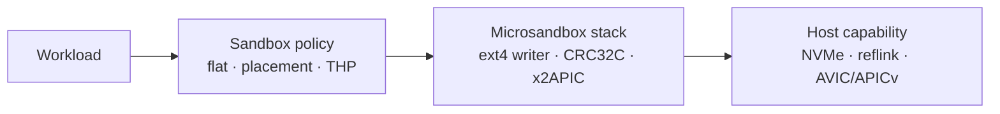
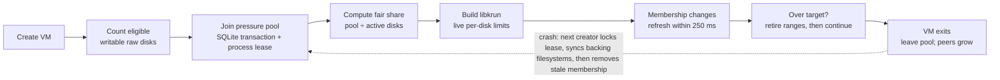

Microsandbox performance comes from three different layers: operator-selected sandbox policy, optimizations built into the shipping runtime and guest firmware, and capabilities supplied by the host. Treating all three as ordinary knobs is misleading. A setting such as `root_disk: flat` changes sandbox construction, while x2APIC is already part of the compatible Linux x86 guest stack and AVIC remains a privileged host-wide KVM capability.



Start with `msb doctor`, keep the workload and benchmark procedure unchanged, and then change one policy at a time. A faster host cannot compensate for an unsuitable root-disk layout, and an optimized guest cannot enable a KVM feature that the host kernel or cloud provider hides.

## Optimization map

| Control or capability | Built-in behavior | Primary effect | Where it applies |
| --- | --- | --- | --- |
| `sandbox_defaults.oci.root_disk` | Managed layered root | Chooses layered EROFS + OverlayFS or one directly mounted flat ext4 root | Local OCI sandboxes |
| Flat `clone` strategy | `auto` | Controls whether private flat roots use a metadata-only copy-on-write clone or a sparse copy | Local storage provisioning |
| `sandbox_defaults.cpu_placement` | `inherit` | Coordinates and pins vCPU threads to host logical processors | Linux and Windows hosts |
| `sandbox_defaults.thp` | `madvise` | Sets the guest Linux transparent-huge-page boot policy | Every newly booted sandbox |
| `runtime.block_writeback` | `auto` | Bounds buffered host dirty data per writable raw disk and live-shares one derived pool without rejecting creates | Linux, writable raw disks using writeback caching |
| x2APIC, CRC32C, PREEMPT_NONE | Selected by the compatible runtime and firmware | Reduces interrupt, checksum, and scheduler overhead | Applicable shipping guest builds |
| AMD AVIC or Intel APICv | Host KVM policy | Accelerates virtual interrupt delivery used by the x86 guest | Linux x86 hosts with capable hardware |

Explicit CLI or SDK settings override `config.json`, which overrides built-in defaults. The resolved sandbox policy is persisted, so changing global defaults affects future sandboxes rather than silently changing existing ones.

| Policy | Global configuration | Explicit CLI override |
| --- | --- | --- |
| Root layout and clone strategy | `sandbox_defaults.oci.root_disk` | `--root-disk flat:8G,clone=auto` |
| CPU placement | `sandbox_defaults.cpu_placement` | `--cpu-placement inherit|auto|spread|compact` |
| Guest THP | `sandbox_defaults.thp` | `--thp always|madvise|never` |
| Buffered block writeback limit and pressure pool | `runtime.block_writeback` | Global runtime policy only |

The Rust, TypeScript, Python, and Go SDK builders expose the same per-sandbox choices. The block writeback limit and pool are global because they control host VMM storage policy rather than one guest-visible sandbox specification.

## A measured starting profile

There is no universal fastest profile. The following is a reasonable starting point for a dedicated Linux or Windows throughput host when the workload accepts a flat root:

```json
{
  "sandbox_defaults": {
    "cpu_placement": "auto",
    "thp": "madvise",
    "oci": {
      "root_disk": {
        "kind": "flat",
        "size_mib": 8192,
        "clone": "auto"
      }
    }
  },
  "runtime": {
    "block_writeback": {
      "mode": "auto"
    }
  }
}
```

`cpu_placement: auto` is intentionally not a portable macOS default: managed placement is unsupported on macOS because the operating system does not expose an equivalent public hard-affinity API. Use `inherit` on macOS. Keep `thp: madvise` unless a representative workload and density test justify another policy. On Linux, the default writeback `auto` policy gives an idle disk the measured 1.5 GiB window that kept the unchanged OVH customer disk suite at containment-off throughput. When more writable disks join than the pool can support at that maximum, all live VMMs reduce their targets to a fair share and apply write pressure instead of rejecting the new sandbox. On macOS and Windows, unconfigured `auto` is a no-op because this controller governs Linux host page-cache writeback. Use `fixed` when a different per-disk maximum is justified by measurement.

## Storage layout: layered or flat

The default layered layout mounts immutable EROFS image layers and directs writes into an ext4 upper through guest OverlayFS. It preserves OCI layer sharing and is the compatibility-first choice. A flat root materializes the final OCI filesystem once into a reusable raw ext4 base, privately clones that base for each sandbox, and mounts the clone directly without guest OverlayFS.

| Workload property | Prefer layered | Consider flat |
| --- | --- | --- |
| Heavy metadata traversal, hardlinks, renames, or filesystem streaming | OverlayFS behavior is acceptable | Removing OverlayFS and stitched lower-layer lookup is valuable |
| Many images share the same OCI lower layers | Layer deduplication matters most | One reusable merged base per manifest is acceptable |
| Rootfs patches or cloud execution | Required | Flat v1 does not support these paths |
| Stopped-sandbox snapshots | Supported | Supported |
| Sandbox creation | No flat image clone or grow step | Fast with reflink; potentially slower with sparse-copy fallback |

Flat removes guest OverlayFS overhead, but it does not bypass ext4, virtio-blk, host page cache policy, or the physical storage device. It can materially improve filesystem-heavy workloads while leaving CPU-only work unchanged. It can also move cost into first materialization, private-root provisioning, or copy-on-write allocation during the first writes to cloned extents.

Use the CLI explicitly for one sandbox:

```bash
msb pull python:3.12 --materialize flat
msb create python:3.12 --name worker --root-disk flat:8G,clone=auto
```

Or set the global flat default shown above. With that default, plain `msb pull python:3.12` prepares the flat artifact automatically.

### Reflink-capable storage

`clone=auto` tries the platform's native clone primitive and falls back to an independent sparse copy. `clone=reflink` makes native copy-on-write cloning mandatory and fails instead of hiding a potentially expensive copy. `clone=copy` always uses the portable sparse-copy path.

A practical Linux deployment places the effective cache and sandbox paths on local NVMe-backed XFS created with reflink support, Btrfs, or bcachefs. macOS uses `clonefile` on APFS. Windows uses block cloning only when the destination volume advertises block refcounting, such as supported ReFS and Dev Drive configurations. A filesystem being copy-on-write internally is not sufficient by itself: it must implement the platform clone operation for regular files, and the source and destination must be on a compatible filesystem or volume.

Run the actual capability probe instead of inferring support from a filesystem name:

```bash
msb doctor
```

Look for `Root clone: reflink supported`. `copy fallback — reflink unavailable` is safe and correct, but flat sandbox creation may take longer and private roots may initially consume more physical storage. The doctor probe runs inside `MSB_HOME` and represents the default directory layout. If `paths.cache`, `paths.sandboxes`, or `MSB_HOME` are placed on different mounts or volumes, `clone=auto` can still fall back at creation time because cross-filesystem reflinks are normally unavailable.

Reflink optimizes provisioning rather than promising faster steady-state writes. Shared extents become private on first modification, so write-heavy workloads can experience copy-on-write allocation or fragmentation. Benchmark both provisioning latency and in-sandbox disk behavior.

## CPU placement

`inherit` performs no topology discovery, central allocation, lease creation, or affinity call. It is the lowest-complexity choice when an external orchestrator already constrains the Microsandbox process. Managed `auto`, `spread`, and `compact` policies coordinate through the allocation catalog associated with one `MSB_HOME` and apply hard affinity to libkrun vCPU threads.

| Policy | Use when | Tradeoff |
| --- | --- | --- |
| `inherit` | The host scheduler or an external orchestrator owns placement | No cooperative isolation from other Microsandbox vCPUs |
| `auto` | A general dedicated host should choose between spread and compact | Result depends on topology and requested `max_cpus` |
| `spread` | Throughput benefits from distinct physical cores and avoiding SMT siblings | Consumes more physical cores and can reduce packing density |
| `compact` | Cache locality and host packing matter more than avoiding SMT siblings | Sibling contention can hurt compute-heavy workloads |

Managed placement reserves for `max_cpus`, including vCPUs that are offline at boot. It does not pin VMM device workers, isolate unrelated host processes, allocate NUMA-local guest memory, or promise dedicated physical cores. All cooperating processes must use the same machine-wide `MSB_HOME` if the allocation catalog is expected to coordinate the whole host. See [CPU placement](/sandboxes/cpu-placement) for the complete guarantees and platform behavior.

## Guest transparent huge pages

The THP policy is a guest Linux boot setting. Microsandbox appends exactly one `transparent_hugepage=always|madvise|never` kernel parameter for the sandbox; it does not reserve host huge pages, change the host THP policy, or guarantee how the host hypervisor backs guest memory.

| Policy | Expected benefit | Possible cost |
| --- | --- | --- |
| `madvise` | Conservative default that lets applications request large mappings | Applications that never advise may receive little benefit |
| `always` | Can reduce guest TLB pressure for large, sustained memory workloads | Can add guest allocation/compaction stalls or waste memory for fragmented, small-working-set workloads |
| `never` | Predictable small-page behavior | More guest page-table and TLB overhead for large working sets |

Changing THP affects the next boot; it is not a live host toggle. Test memory bandwidth, allocation latency, and tail latency together rather than selecting `always` from bandwidth alone.

## Interrupt acceleration: x2APIC, AVIC, and APICv

x2APIC and AVIC are complementary, not competing versions of one feature. x2APIC is the interrupt-controller interface used by the Linux x86 guest. AMD AVIC and Intel APICv are host virtualization mechanisms that let KVM deliver more virtual interrupt work in hardware instead of exiting to the host.

The compatible Linux x86 firmware is built with x2APIC support and the VMM exposes the required guest topology; there is no SDK or CLI switch. On a capable AMD or Intel Linux host, KVM may additionally accelerate that guest interface through AVIC or APICv. Hardware capability, live KVM module policy, nested-virtualization exposure, and the VM configuration all participate in the final decision.

Use `msb doctor` as the operator-facing check:

```text
KVM AVIC   enabled (x2AVIC available)
KVM APICv  enabled by KVM policy
```

Doctor reports only the applicable row. It does not show AVIC on Intel, APICv on AMD, or either row on platforms where KVM policy cannot be inspected. On a nested VM or public-cloud instance, the outer hypervisor may hide the capability; that cannot be repaired from inside the instance. Doctor reports host policy and advertised capability, not proof that one particular running sandbox used hardware acceleration.

If AVIC or APICv is available but disabled, doctor prints the current-boot module reload command. This is a privileged, host-wide operation: every KVM user must be stopped before unloading `kvm_amd` or `kvm_intel`. When the driver is built into the kernel or cannot be unloaded, configure the equivalent module or kernel parameter through the host's normal boot mechanism and reboot. Microsandbox never changes this policy automatically because doing so would disrupt unrelated VMs.

<Accordion title="Current-boot KVM policy commands">

AMD:

```bash
sudo modprobe -r kvm_amd && sudo modprobe kvm_amd avic=1
cat /sys/module/kvm_amd/parameters/avic
```

Intel:

```bash
sudo modprobe -r kvm_intel && sudo modprobe kvm_intel enable_apicv=1
cat /sys/module/kvm_intel/parameters/enable_apicv
```

Do not run either command while `/dev/kvm` has users. A distribution may build KVM into the kernel, prevent module removal, or require the setting to be persisted in its boot configuration instead.

</Accordion>

Enabling AVIC or APICv changes interrupt-delivery performance, not the sandbox isolation or guest durability contract. Measure network packet processing, concurrent ingress, timers, and interrupt-heavy storage alongside startup and filesystem operations because the tradeoff is not necessarily uniform across workloads.

## Buffered block writeback limit

The default `auto` policy uses up to a 1536 MiB hard budget for each writable raw disk on Linux. That window is the smallest tested final-scheduler profile that preserved the unchanged customer suite's approximately 1 GiB hot file at containment-off sequential-write throughput. Libkrun reserves exact page-aligned extents before each mutation and lets that finite cache window absorb hot rewrites. It starts bounded background retirement only when a new unique page would exceed the hard budget or the exact extent ledger reaches its fragmentation ceiling. Rewriting an already charged page consumes no new credit; a truly growing working set receives backpressure before it can cross the limit.

When pressure does require retirement, the background worker kicks queued ranges before waiting for their page-cache writeback to complete, and it releases exact range credit only after that completion. It does not turn each internal batch into a durability barrier. Guest `FLUSH` still performs the existing full Imago flush and sync after all earlier block work, including the host-filesystem metadata required to retrieve the data; the controller does not acknowledge guest durability early. Controller, storage, worker, range-completion, or full-sync failures remain latched and fail future mutations and reactivations closed.

Every active policy also joins one aggregate dirty-credit pressure pool. The default pool is the lower of 10% of physical memory and a conservative estimate of the host's dirty-background threshold. An explicit `vm.dirty_background_bytes` is used directly; ratio mode applies `vm.dirty_background_ratio` to current `MemAvailable`, not `MemTotal`, because Linux explicitly excludes unavailable memory from its ratio denominator. Each disk keeps its configured maximum while capacity is available. Under pressure, weighted max-min sharing gives every eligible writable disk the same target unless that disk's maximum is smaller. A new sandbox therefore starts under pressure instead of failing at the capacity boundary. Set `pool_mib` only when an operator needs to override the derived aggregate capacity.

For example, this fixed profile gives up to eight active writable disks the complete 1.5 GiB window inside a 12 GiB pool. A ninth disk still starts, but all nine targets become roughly 1.33 GiB until one leaves:

```json
{
  "runtime": {
    "block_writeback": {
      "mode": "fixed",
      "per_disk_mib": 1536,
      "pool_mib": 12288
    }
  }
}
```

Each VM records its requested per-disk maximum and eligible writable-disk count in one retryable SQLite transaction before libkrun is built. This is membership bookkeeping, not hard admission: concurrent creators all join, then weighted max-min sharing computes each live per-disk target from the active set. An owner-only process lock makes stale membership detectable. Normal release synchronizes retained descriptors for the exact verified backing files before leaving the pool, so containment does not depend on a cooperative guest issuing `FLUSH`. After a process crash in the same boot, those descriptors are gone; the next creator acquires the stale lease and performs `syncfs` on each identity-verified recorded backing filesystem before removing the membership. After a host reboot, the old page cache is already gone. This coordination and recovery path is not on the block-I/O path: libkrun enforces the current per-disk target locally after boot.



The allocation catalog and leases are shared by processes using the same `MSB_HOME`. Production processes contributing to one node budget therefore need the same runtime home and service identity; separate homes are separate administrative domains. A lower target cannot erase dirty pages that already exist, so the aggregate pool is a convergence boundary rather than an instantaneous reservation invariant: after membership grows, existing controllers retire excess ownership before admitting more writes. It is not a substitute for sizing guest memory, storage capacity, or unrelated host workloads.

`off` is an explicit compatibility escape hatch that disables both the VMM-owned bound and pressure coordination for newly spawned sandboxes. It permits a long-running guest to accumulate more host dirty data and may worsen the final flush tail. It is not faster than the correctly sized pressure-triggered window in the focused OVH customer disk suite: an idle 1536 MiB window reached 8,933.5 MB/s sequential write versus 8,895 MB/s with containment off, while a 512 MiB target reached only 1,406.5 MB/s. Pool pressure intentionally trades that cache-assisted burst performance for density without turning capacity into a sandbox-creation failure. Neither the per-disk controller nor coordination depends on cgroups or guest cooperation. The policy has no effect on read-only disks, direct-I/O disks, non-raw formats, cache modes without writeback, or non-Linux VMM paths.

The first OVH staircase exposed why simply raising the hard ceiling did not help: every profile still retired hot data in eager 128–256 MiB generations and delivered approximately 1,668 MB/s sequential write against 8,783 MB/s with the controller off. The pressure-triggered design instead keeps a repeatedly overwritten 1 GiB fio file resident inside a 1.5 GiB finite window and retires data only when unique dirty coverage would cross the bound. In the unchanged exact-candidate follow-up, sequential write recovered to 8,933.5 MB/s versus 8,895 MB/s off, and all eight emitted metrics were at parity or above. The dated planning report records the original staircase, corrected customer-suite measurements, exact final candidate, host dirty telemetry and crash-safe multi-VM pressure validation.

## Optimizations that are not knobs

The following belong to the compatible release stack and intentionally do not create more configuration surface:

- **Pure-Rust ext4 materialization** builds flat OCI filesystems on the host without mounting an untrusted image or booting a builder VM. It is part of flat correctness and portability.
- **CRC32C support** is present in the shipping guest kernel so ext4 metadata checksumming can use the architecture's available implementation. Correctness never depends on optional acceleration being present.
- **PREEMPT_NONE** is selected in the optimized Linux guest firmware to reduce scheduler overhead for throughput-oriented sandbox workloads. It is a firmware policy, not an `agentd` setting or a host scheduler change.
- **x2APIC** is part of the compatible Linux x86 guest/VMM stack. Operators control the complementary host KVM policy through AVIC or APICv, not through a sandbox API.
- **vCPU affinity mechanics** are internal enforcement for the public placement policy. The public choice is `inherit`, `auto`, `spread`, or `compact`, not an implementation-specific CPU map.

Keeping these automatic avoids combinations that were never validated together and lets the compatible `msb`, libkrun, and libkrunfw versions move as one tested stack.

## Platform expectations

| Capability | Linux x86 | macOS | Windows | Nested or cloud Linux |
| --- | --- | --- | --- | --- |
| Flat raw ext4 root | Yes | Yes | Yes | Yes, subject to outer storage behavior |
| Native flat-root clone | `FICLONE` on a capable filesystem | `clonefile` on APFS | Block cloning on a capable volume | Often unavailable across virtual or network-backed paths; probe it |
| Managed CPU placement | Yes | No; use `inherit` | Yes, within supported processor-group boundaries | Yes if the outer scheduler exposes a useful topology, but not dedicated cores |
| Guest THP policy | Yes | Yes; still a guest Linux policy | Yes; still a guest Linux policy | Yes, but host backing remains controlled by the provider |
| AVIC/APICv doctor row | Applicable KVM capability only | Not shown | Not shown; WHP owns acceleration | Shown only if the outer hypervisor exposes inspectable KVM capability |
| Buffered block writeback limit | Applicable optimized raw writeback path | No effect | No effect | Applicable only when the inner Linux VMM reaches the required file path |

## Verify the resolved result

Run doctor before creating production sandboxes, then inspect a created sandbox rather than assuming the global file was applied:

```bash
msb doctor
msb inspect worker
```

`msb inspect` shows the resolved root disk and clone result, CPU placement, THP policy, CPU capacity, and memory capacity. For example, `clone=auto -> reflink` proves that the sandbox's actual private root used a reflink, while `clone=auto -> copy` records the safe fallback.

When comparing policies, keep the same benchmark, image, resource limits, host power policy, storage mount, warm/cold cache condition, and concurrency. Record provisioning and steady-state results separately: reflink mostly changes creation, flat changes the guest filesystem path, placement changes scheduling, THP changes memory translation, and AVIC/APICv changes interrupt delivery.

## References

- [Global configuration reference](/configuration)
- [Flat root-disk API](/sandboxes/customize#flat-oci-rootfs)
- [CPU placement guarantees](/sandboxes/cpu-placement)
- [Linux KVM APIC virtualization checks](https://docs.kernel.org/6.2/virt/kvm/x86/running-nested-guests.html)
- [Linux Btrfs reflink capability](https://docs.kernel.org/filesystems/btrfs.html)
- [Apple APFS cloning APIs](https://developer.apple.com/library/archive/documentation/FileManagement/Conceptual/APFS_Guide/ToolsandAPIs/ToolsandAPIs.html)
- [Windows block cloning](https://learn.microsoft.com/en-us/windows/win32/fileio/block-cloning)
