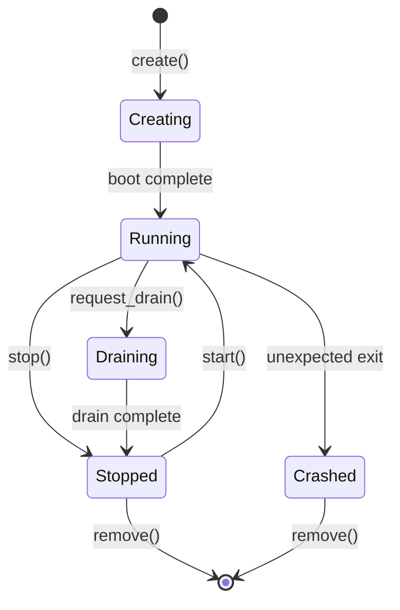
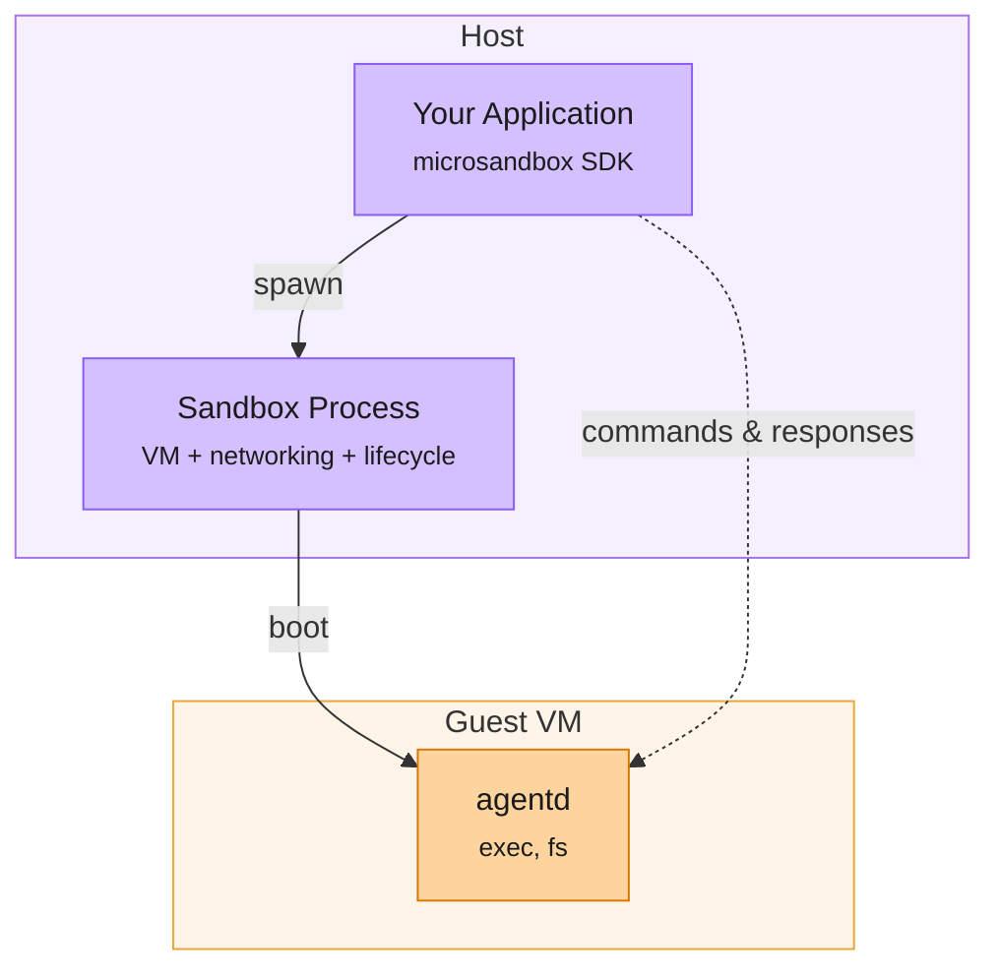

Each sandbox runs as a child process of whatever application creates it. `Sandbox.builder(...).create()` boots a microVM, starts the guest agent inside it, and establishes a communication channel back to the host.

Understanding the lifecycle is useful once you start managing long-running sandboxes, graceful shutdown, or resilient agent workflows.



## States

| Status | Description |
|--------|-------------|
| **Creating** | The VM is booting. The kernel is loaded, the filesystem is mounted, and the guest agent is initializing (configuring network, setting up the environment). |
| **Running** | The guest agent is ready. You can call `exec`, `shell`, and `fs`. |
| **Draining** | Graceful shutdown in progress. Existing commands run to completion, but new `exec` calls are rejected. Transitions to Stopped when all commands finish. |
| **Stopped** | The VM has shut down. Sandbox configuration and state are persisted to the database and can be restarted. |
| **Crashed** | The VM exited unexpectedly (e.g., kernel panic, OOM kill). |

## Create a sandbox

Creating a sandbox boots the microVM, mounts the filesystem, initializes the guest agent, and waits until it's ready to accept commands. Names must be non-empty and no longer than 128 UTF-8 bytes.

<CodeGroup>
```rust Rust
// Attached: sandbox stops when your process exits
let sb = Sandbox::builder("worker").image("python").create().await?;

// Detached: sandbox survives after your process exits
let sb = Sandbox::builder("worker")
    .image("python")
    .detached(true)
    .create()
    .await?;
```

```typescript TypeScript
// Attached: sandbox stops when your process exits
await using sb = await Sandbox.builder("worker").image("python").create();

// Detached: sandbox survives after your process exits
const detached = await Sandbox.builder("worker")
  .image("python")
  .detached(true)
  .create();
```

```python Python
# Attached: sandbox stops when your process exits
sb = await Sandbox.create("worker", image="python")

# Detached: sandbox survives after your process exits
sb = await Sandbox.create("worker", image="python", detached=True)
await sb.detach()
```

```go Go
// Attached: sandbox stops when your process exits
sb, err := m.CreateSandbox(ctx, "worker", m.WithImage("python"))

// Detached: sandbox survives after your process exits
detached, err := m.CreateSandbox(ctx, "worker",
    m.WithImage("python"),
    m.WithDetached(),
)
```

```bash CLI
# Attached
msb create python --name worker

# Detached
msb run -d python --name worker
```

</CodeGroup>

## Stop and restart

Stopping gracefully terminates guest processes and shuts down the VM. The sandbox moves to `Stopped` and can be restarted later with all its configuration preserved.

<CodeGroup>
```rust Rust
sb.stop().await?;

let sb = Sandbox::start("worker").await?;
```

```typescript TypeScript
await sb.stop()

// Later, resume where you left off
const sb = await Sandbox.start("worker")
```

```python Python
await sb.stop()

# Later, resume where you left off
sb = await Sandbox.start("worker")
```

```go Go
_ = sb.Stop(ctx)

// Later, resume where you left off
sb, err := m.StartSandbox(ctx, "worker")
```

```bash CLI
msb stop worker

# Later, resume where you left off
msb start worker

# Or stop and start in one command
msb restart worker
```

</CodeGroup>

`msb restart` follows the same lifecycle semantics as `msb stop` followed by `msb start`. If the sandbox is already stopped or crashed, it starts it directly.

## Ping and touch

Use `ping` to check that a running sandbox's guest agent is reachable, and `touch` to intentionally refresh its idle timer. Ping is a health check only: it does not count as sandbox activity and will not keep an idle sandbox alive by itself. Touch is the explicit keepalive.

<CodeGroup>
```rust Rust
let ping = sb.ping().await?;
println!("agent reachable in {:?}", ping.latency);

sb.touch().await?;
```

```bash CLI
msb ping worker
msb touch worker

# Health check and then keep alive if reachable
msb ping worker --touch
```

</CodeGroup>

## Kill immediately

If a sandbox is unresponsive (e.g., stuck in a tight loop or a panic), force-kill it. The sandbox is terminated immediately with no graceful shutdown.

<CodeGroup>
```rust Rust
sb.kill().await?;
```

```typescript TypeScript
await sb.kill()
```

```python Python
await sb.kill()
```

```go Go
err := sb.Kill(ctx)
```

```bash CLI
msb stop --force worker
```

</CodeGroup>

## Detach

Keeps a sandbox running after the parent process exits. It becomes a background process that you can reconnect to later with `Sandbox::get("worker")`.

<CodeGroup>
```rust Rust
sb.detach().await;
```

```typescript TypeScript
await sb.detach()
```

```python Python
await sb.detach()
```

```go Go
err := sb.Detach(ctx)
```

</CodeGroup>

## Request drain

Trigger a graceful shutdown that lets existing commands finish but rejects new ones. The sandbox moves to `Draining` and transitions to `Stopped` when all in-flight commands complete. This is useful for zero-downtime rotation of worker sandboxes.

<CodeGroup>
```rust Rust
sb.request_drain().await?;
```

```typescript TypeScript
await sb.requestDrain()
```

```python Python
await sb.request_drain()
```

```go Go
err := sb.RequestDrain(ctx)
```

</CodeGroup>

## Wait until stopped

Block until the sandbox is observed in a terminal non-running state, without triggering a stop or kill request.

<CodeGroup>
```rust Rust
let result = sb.wait_until_stopped().await?;
```

```typescript TypeScript
const result = await sb.waitUntilStopped()
```

```python Python
result = await sb.wait_until_stopped()
```

```go Go
result, err := sb.WaitUntilStopped(ctx)
```

</CodeGroup>

## Remove

Delete a stopped sandbox and its associated state from disk.

<CodeGroup>
```rust Rust
Sandbox::remove("worker").await?;
```

```typescript TypeScript
await Sandbox.remove("worker")
```

```python Python
await Sandbox.remove("worker")
```

```go Go
err := m.RemoveSandbox(ctx, "worker")
```

```bash CLI
msb rm worker
```

</CodeGroup>

## List and inspect

<CodeGroup>
```rust Rust
for handle in Sandbox::list().await? {
    println!("{}: {:?}", handle.name(), handle.status_snapshot());
}
```

```typescript TypeScript
const sandboxes = await Sandbox.list();
for (const handle of sandboxes) {
    console.log(`${handle.name}: ${handle.status}`);
}

const handle = await Sandbox.get("worker");
console.log(handle.status); // "running" | "stopped" | ...
```

```python Python
for handle in await Sandbox.list():
    print(f"{handle.name}: {handle.status}")

handle = await Sandbox.get("worker")
print(handle.status)  # "running" | "stopped" | ...
```

```go Go
handles, err := m.ListSandboxes(ctx)
for _, handle := range handles {
    fmt.Printf("%s: %s\n", handle.Name(), handle.Status())
}

handle, err := m.GetSandbox(ctx, "worker")
fmt.Println(handle.Status()) // "running" | "stopped" | ...
```

```bash CLI
msb ls
msb ps worker
```

</CodeGroup>

## Runtime process architecture

At runtime, your application talks to a host-side sandbox process, and that process relays requests to the guest agent inside the VM.



The sandbox process also handles:

- Graceful stop and drain signals
- Cleanup when the sandbox exits
- Idle detection and maximum lifetime enforcement

## Logs and diagnostics

Use [`msb logs`](/cli/sandbox-commands#msb-logs) or the SDK `logs()` method to read captured output from running, stopped, or crashed sandboxes. For source semantics, boot errors, and diagnostic flows, see [Logs](/sandboxes/logs).

## Sandbox process policies

For production workloads, configure how the sandbox process handles shutdown, idle detection, and maximum lifetime.

<CodeGroup>
```rust Rust
let sb = Sandbox::builder("worker")
    .image("python")
    .max_duration(3600)
    .idle_timeout(300)
    .create()
    .await?;
```

```typescript TypeScript
await using sb = await Sandbox.builder("worker")
    .image("python")
    .maxDuration(3600)   // maximum sandbox lifetime in seconds
    .idleTimeout(300)    // auto-drain after 5 minutes of inactivity
    .create();
```

```python Python
sb = await Sandbox.create(
    "worker",
    image="python",
    max_duration=3600,
    idle_timeout=300,
)
```

```go Go
sb, err := m.CreateSandbox(ctx, "worker",
    m.WithImage("python"),
    m.WithMaxDuration(time.Hour),
    m.WithIdleTimeout(5*time.Minute),
)
```

</CodeGroup>
