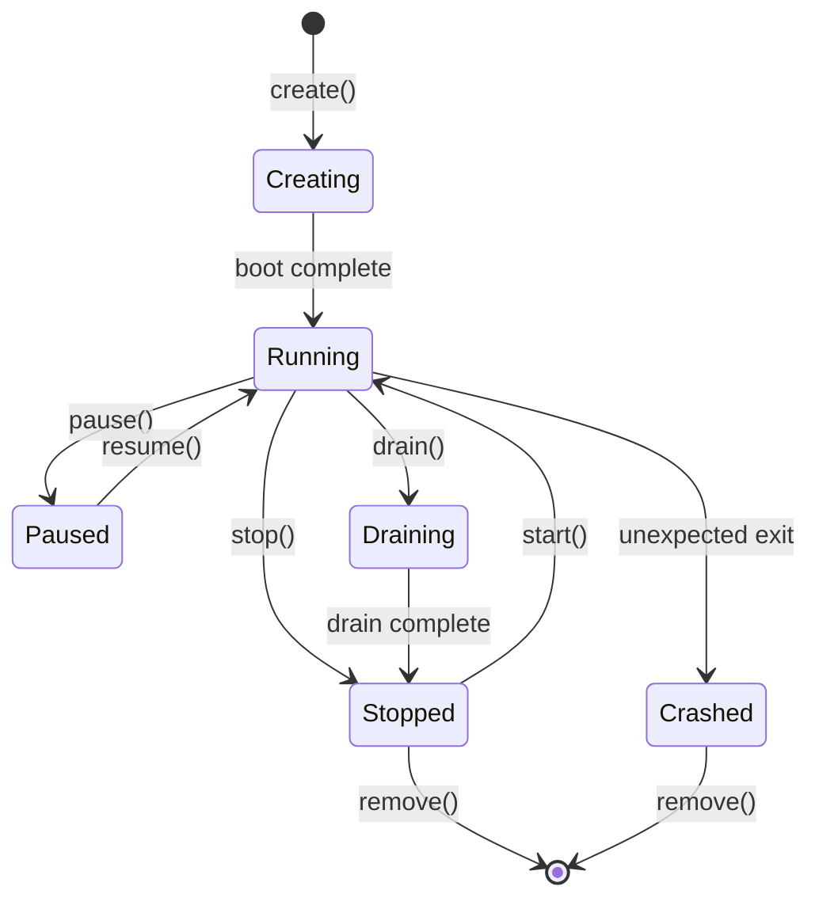
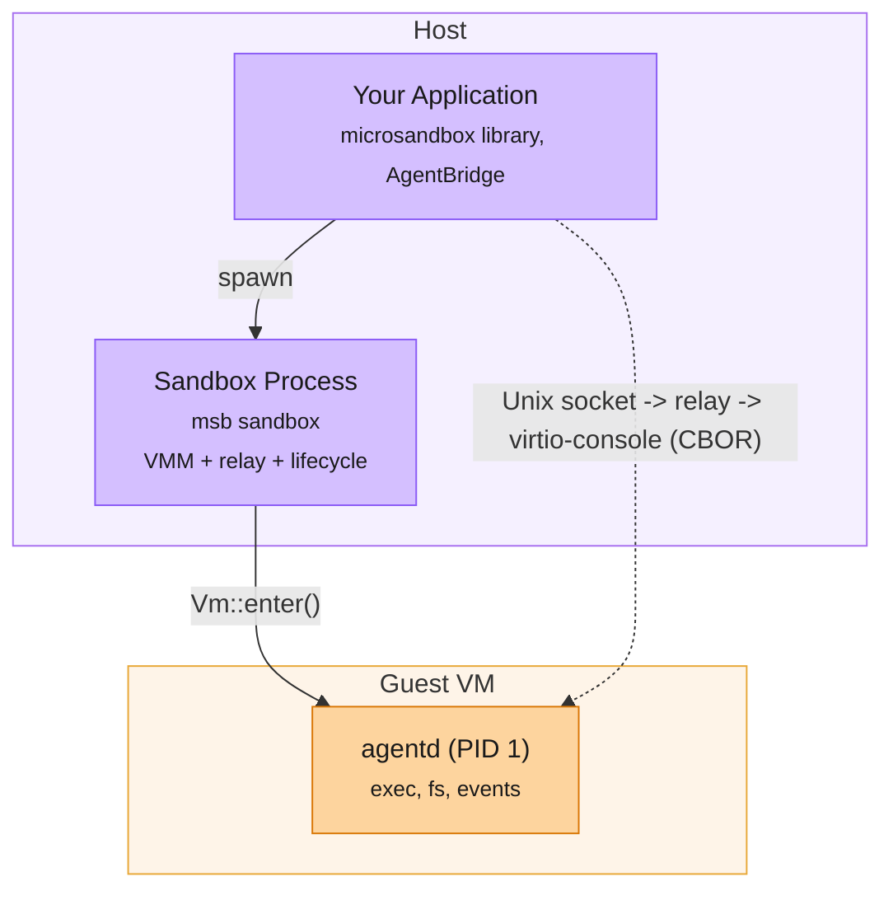

Sandboxes move through a simple set of states. Understanding the lifecycle helps you manage long-running sandboxes, implement graceful shutdown, and build resilient agent workflows.



## States

| Status | Description |
|--------|-------------|
| **Creating** | The VM is booting and the filesystem is being prepared |
| **Running** | The VM is up and the guest agent is ready to accept commands |
| **Paused** | All processes are frozen. No CPU usage. Resumes instantly |
| **Draining** | Graceful shutdown is in progress. Existing commands finish, but new ones are rejected |
| **Stopped** | The VM has shut down. State is preserved on disk and can be restarted |
| **Crashed** | The VM exited unexpectedly |

## Create a sandbox

Creating a sandbox boots the microVM, mounts the filesystem, and starts the guest agent. Once creation completes, the sandbox is `Running` and ready for commands.

<CodeGroup>
```rust Rust
// Attached
let sb = Sandbox::builder("worker").image("python:3.12").create().await?;

// Detached
let sb = Sandbox::builder("worker").image("python:3.12").create_detached().await?;
```

```typescript TypeScript
// Standard creation (attached, sandbox stops when your process exits)
const sb = await Sandbox.create({ name: "worker", image: "python:3.12" })

// Detached creation (sandbox survives after your process exits)
const sb = await Sandbox.create({ name: "worker", image: "python:3.12", detached: true })
```

```python Python
sb = await Sandbox.create("worker", image="python:3.12")
```
</CodeGroup>

## Stop and restart

Stopping sends a graceful shutdown signal to the guest agent. The sandbox moves to `Stopped` and can be restarted later with all its state preserved.

<CodeGroup>
```rust Rust
sb.stop().await?;

let sb = Sandbox::start("worker").await?;
```

```typescript TypeScript
await sb.stop()

// Later, resume where you left off
const sb = await Sandbox.start("worker")
```

```python Python
await sb.stop()

sb = await Sandbox.start("worker")
```
</CodeGroup>

## Kill immediately

If a sandbox is unresponsive, you can force-kill it with SIGKILL. This is instant but doesn't give the guest a chance to clean up.

<CodeGroup>
```rust Rust
sb.kill().await?;
```

```typescript TypeScript
await sb.kill()
```

```python Python
await sb.kill()
```
</CodeGroup>

## Pause and resume

Freeze all processes in a sandbox without shutting it down. The VM stays in memory but uses no CPU. Resume is instant with no boot time.

<CodeGroup>
```rust Rust
sb.pause().await?;
sb.resume().await?;
```

```typescript TypeScript
await sb.pause()
await sb.resume()
```

```python Python
await sb.pause()
await sb.resume()
```

</CodeGroup>

## Detach

Keep a sandbox running after your process exits. Useful for long-running agents or background workers.

<CodeGroup>
```rust Rust
sb.detach().await;
```

```typescript TypeScript
await sb.detach()
```

```python Python
await sb.detach()
```
</CodeGroup>

## Drain

Trigger a graceful shutdown that lets existing commands finish but rejects new ones. The sandbox moves to `Draining` and eventually to `Stopped`.

<CodeGroup>
```rust Rust
sb.drain().await?;
```

```typescript TypeScript
await sb.drain()
```

```python Python
await sb.drain()
```
</CodeGroup>

## Remove

Delete a stopped sandbox and its associated state from disk.

<CodeGroup>
```rust Rust
Sandbox::remove("worker").await?;
```

```typescript TypeScript
await Sandbox.remove("worker")
```

```python Python
await Sandbox.remove("worker")
```
</CodeGroup>

## List and inspect

<CodeGroup>
```rust Rust
for handle in Sandbox::list().await? {
    println!("{}: {:?}", handle.name(), handle.status());
}
```

```typescript TypeScript
const sandboxes = await Sandbox.list()
for (const info of sandboxes) {
    console.log(`${info.name}: ${info.status}`)
}

const handle = await Sandbox.get("worker")
console.log(handle.status) // "Running" | "Stopped" | ...
```

```python Python
sandboxes = await Sandbox.list()
for info in sandboxes:
    print(f"{info.name}: {info.status}")
```
</CodeGroup>

## Runtime process architecture

When you create a sandbox, a few things start running behind the scenes. Here's what runs where and how they talk to each other.



There are two separate layers here. Your application talks to the host-side sandbox process over the agent relay socket, and the sandbox process forwards CBOR-encoded messages to the guest agent (`agentd`) over virtio-console. This is how `exec`, `attach`, `fs`, and `emit` calls work.

The **sandbox process** is the host-side runtime process created by `msb sandbox`. It hosts the VMM and handles:

- Forwarding signals (SIGTERM for graceful stop, SIGUSR1 for drain)
- Driving VM exit and shutdown policies
- Monitoring idle state via the agentd heartbeat
- Enforcing maximum sandbox lifetime
- Writing logs and updating sandbox status in the database

The sandbox process does *not* execute guest commands itself. It relays agent protocol traffic between your application and `agentd`.

## Sandbox Process Policies

For production workloads, you can configure how the sandbox process handles shutdown, idle detection, and maximum lifetime.

<CodeGroup>
```rust Rust
let sb = Sandbox::builder("worker")
    .image("python:3.12")
    .shutdown_mode(ShutdownMode::Terminate)
    .grace_period(30)
    .max_duration(3600)
    .idle_timeout(300)
    .create()
    .await?;
```

```typescript TypeScript
const sb = await Sandbox.create({
    name: "worker",
    image: "python:3.12",
    shutdownMode: ShutdownMode.Graceful, // Graceful → Terminate → Kill escalation
    gracePeriod: 30,    // seconds between escalation steps
    maxDuration: 3600,  // maximum sandbox lifetime in seconds
    idleTimeout: 300,   // auto-drain after 5 minutes of inactivity
})
```

```python Python
from microsandbox import Sandbox, ShutdownMode

sb = await Sandbox.create(
    "worker",
    image="python:3.12",
    shutdown_mode=ShutdownMode.TERMINATE,
    grace_period=30,
    max_duration=3600,
    idle_timeout=300,
)
```
</CodeGroup>
