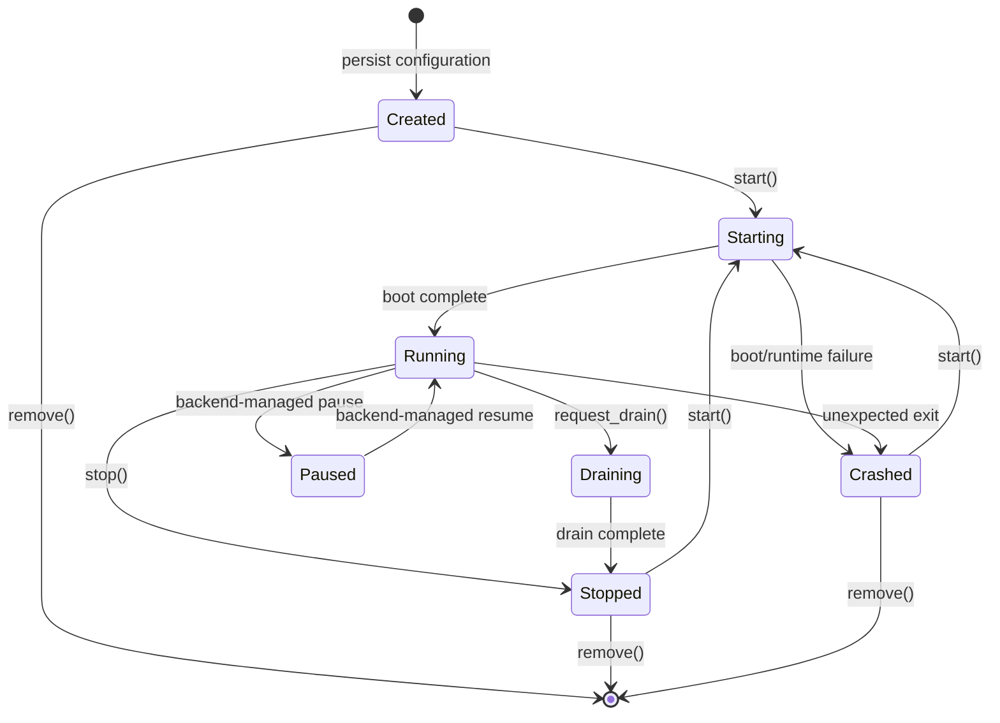
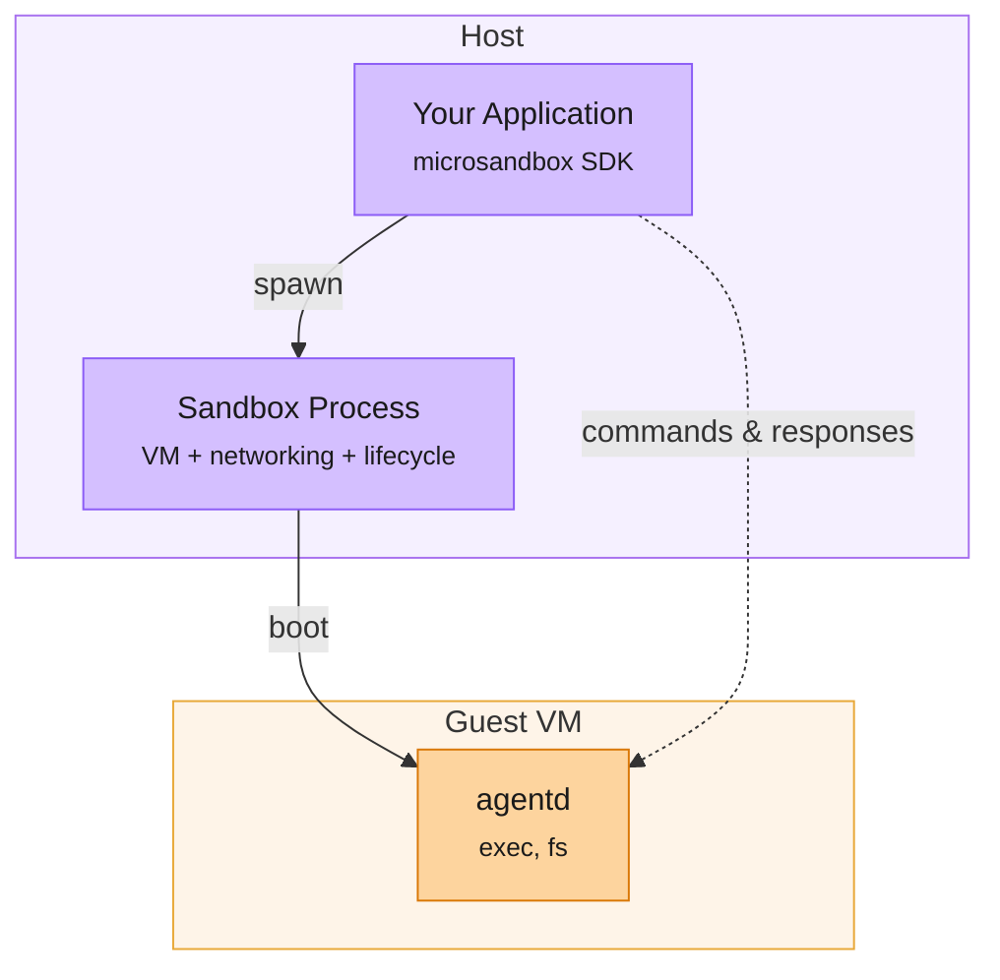

Each sandbox runs as a child process of whatever application creates it. `Sandbox.builder(...).create()` boots a microVM, starts the guest agent inside it, and establishes a communication channel back to the host.

Understanding the lifecycle is useful once you start managing long-running sandboxes, graceful shutdown, or resilient agent workflows.


```mermaid
stateDiagram-v2
    [*] --> Created: persist configuration
    Created --> Starting: start()
    Starting --> Running: boot complete
    Starting --> Crashed: boot/runtime failure
    Running --> Draining: request_drain()
    Running --> Stopped: stop()
    Running --> Crashed: unexpected exit
    Running --> Paused: backend-managed pause
    Paused --> Running: backend-managed resume
    Draining --> Stopped: drain complete
    Stopped --> Starting: start()
    Crashed --> Starting: start()
    Created --> [*]: remove()
    Stopped --> [*]: remove()
    Crashed --> [*]: remove()
```

## States

| Status | Description |
|--------|-------------|
| **Created** | Persisted configuration exists, but no runtime has started yet. |
| **Starting** | The VM is booting. The kernel is loaded, the filesystem is mounted, and the guest agent is initializing. |
| **Running** | The guest agent is ready. You can call `exec`, `shell`, and `fs`. |
| **Draining** | Graceful shutdown in progress. Existing commands run to completion, but new `exec` calls are rejected. Transitions to Stopped when all commands finish. |
| **Paused** | Runtime execution is suspended by the backend. SDK resume support is not currently exposed, so convergent start calls reject this state. |
| **Stopped** | The VM has shut down. Sandbox configuration and state are persisted to the database and can be restarted. |
| **Crashed** | The VM exited unexpectedly (e.g., kernel panic, OOM kill). |

## Create a sandbox

<Tooltip tip="Local attached SDK handles stop their sandbox when the client process exits. Cloud sandboxes are service-owned, so stop or remove them explicitly."><span className="msb-badge-limited">Limited on cloud <Icon icon="circle-info" size={11} /></span></Tooltip>

Creating a sandbox boots the microVM, mounts the filesystem, initializes the guest agent, and waits until it's ready to accept commands. Names must be non-empty and no longer than 128 UTF-8 bytes.

<CodeGroup>
```rust Rust
// Local attached handle: sandbox stops when your process exits
let sb = Sandbox::builder("worker").image("python").create().await?;

// Detached: sandbox survives after your process exits
let sb = Sandbox::builder("worker")
    .image("python")
    .detached(true)
    .create()
    .await?;
```

```typescript TypeScript
// Local attached handle: sandbox stops when your process exits
await using sb = await Sandbox.builder("worker").image("python").create();

// Detached: sandbox survives after your process exits
const detached = await Sandbox.builder("worker")
  .image("python")
  .detached(true)
  .create();
```

```python Python
# Local attached handle: sandbox stops when your process exits
sb = await Sandbox.create("worker", image="python")

# Detached: sandbox survives after your process exits
sb = await Sandbox.create("worker", image="python", detached=True)
await sb.detach()
```

```go Go
// Local attached handle: sandbox stops when your process exits
sb, err := m.CreateSandbox(ctx, "worker", m.WithImage("python"))

// Detached: sandbox survives after your process exits
detached, err := m.CreateSandbox(ctx, "worker",
    m.WithImage("python"),
    m.WithDetached(),
)
```

```ruby Ruby
# Local lifecycle-owning handle: sandbox stops when it is collected
sb = Microsandbox::Sandbox.create("worker", image: "python")

# Detached: sandbox survives after this handle is released
detached = Microsandbox::Sandbox.create("worker", image: "python", detached: true)
detached.detach
```

```bash CLI
# Attached
msb create python --name worker

# Detached
msb run -d python --name worker
```

</CodeGroup>

## Converge on a named sandbox

Use `connect_or_create` when several callers may converge on the same reusable name. It connects if the current persisted sandbox is already running, starts it if it is stopped or crashed, and creates it only when the name is missing. If another caller wins a concurrent create or start, the operation observes the winner and converges on it.

<CodeGroup>
```rust Rust
let sb = Sandbox::builder("worker")
    .image("python")
    .memory(1024)
    .connect_or_create()
    .await?;
```

```typescript TypeScript
const sb = await Sandbox.builder("worker")
  .image("python")
  .memory(MiB(1024))
  .connectOrCreate();
```

```python Python
sb = await Sandbox.connect_or_create(
    "worker",
    image="python",
    memory=1024,
)
```

```go Go
sb, err := m.ConnectOrCreateSandbox(ctx, "worker",
    m.WithImage("python"),
    m.WithMemory(1024),
)
```

```ruby Ruby
sb = Microsandbox::Sandbox.connect_or_create(
  "worker",
  image: "python",
  memory: 1024
)
```
</CodeGroup>

Builder options apply only when a sandbox is created. An existing sandbox always keeps its persisted image, resources, environment, mounts, and other configuration. `connect_or_create` rejects replace options because replacing and converging express conflicting identity semantics.

If you already hold a metadata handle, use `connect_or_start` instead. It connects without taking lifecycle ownership when the exact sandbox is running, waits through `Starting`, or starts the exact persisted sandbox when it is created, stopped, or crashed.

<CodeGroup>
```rust Rust
let handle = Sandbox::get("worker").await?;
let sb = handle.connect_or_start().await?;
```

```typescript TypeScript
const handle = await Sandbox.get("worker");
const sb = await handle.connectOrStart();
```

```python Python
handle = await Sandbox.get("worker")
sb = await handle.connect_or_start()
```

```go Go
handle, err := m.GetSandbox(ctx, "worker")
sb, err := handle.ConnectOrStart(ctx)
```

```ruby Ruby
handle = Microsandbox::Sandbox.get("worker")
sb = handle.connect_or_start
```
</CodeGroup>

`Draining` is not reinterpreted as a start request, and `Paused` requires explicit resume support, which is not currently exposed.

## Identity-safe receivers

Sandbox names are reusable lookup keys. Every `Sandbox` and `SandboxHandle` also exposes an opaque stable `id` (`ID()` in Go) for the persisted sandbox it represents. Do not parse this value; use it for logging, correlation, and equality checks.

On the built-in local and cloud backends, receiver-based status and lifecycle operations remain bound to that captured identity. If `worker` is removed and another sandbox is created with the same name, a stale receiver cannot refresh, start, stop, kill, drain, restart, destroy, or remove the replacement. The SDK returns `SandboxReplaced` (or the language's typed equivalent) when it can observe the new identity; ID-addressed cloud operations may instead report that the old resource is gone. Custom Rust backends should override the `*_identified` backend methods to provide the same guarantee.

This closes the check-then-act race that an `exists()` helper would encourage:

```text
name lookup         stable identity check/action
    │                           │
    ├── connect_or_create ─────────┤ selects the current identity
    │                           │
    └── SandboxHandle(id=A) ────┤ may act only on A, never replacement B
```

Identity safety uses the existing local database row ID and cloud sandbox UUID. It requires no persistence migration or wire-protocol change.

## Lifecycle invariants

The convergent APIs preserve the following contracts across all SDKs:

| Invariant | Contract |
|-----------|----------|
| Name versus identity | A name selects the current persisted sandbox. An opaque ID identifies one exact persisted sandbox, even if the name is later reused. |
| Strict creation | Same-name local creators are serialized across processes. `create` remains strict and the loser receives an already-exists error after the winner finishes; `connect_or_create` observes that winner and returns it. |
| Single start winner | A local start atomically changes the exact persisted identity from `Created`, `Stopped`, or `Crashed` to `Starting`. Concurrent callers cannot both claim the same runtime generation. |
| Single runtime generation | Local database and host-namespace transitions are serialized per name, while a separate process-held lock remains owned for the runtime's lifetime. A successor cannot reuse that name's sockets, pipes, or storage until the previous runtime has exited. |
| Existing configuration wins | Creation options are used only when `connect_or_create` creates. Reuse never overwrites the persisted image, resources, environment, mounts, or other configuration. |
| Readiness is truthful | `Starting` means the VM or guest agent is not ready yet. `Running` is published only after the agent endpoint is connected and commands can be accepted. |
| Exact-handle convergence | `connect_or_start` remains bound to the handle's captured ID. It connects to `Running`, waits through `Starting`, starts `Created`, `Stopped`, or `Crashed`, and rejects `Draining` or `Paused`. |
| Restart continuity | `restart` returns the same persisted ID and retains configuration while replacing only the runtime instance. |
| Destroy finality | `destroy` stops and removes the exact persisted identity. Recreating the same name produces a different ID. |
| Stale receiver refusal | A receiver captured before same-name recreation cannot inspect or mutate the replacement through identity-safe receiver operations. |
| Exact-state waits | `wait_for_status` follows the captured identity and has no implicit deadline. Use the language's normal cancellation or timeout primitive. |

The local coordination is per sandbox name. It does not introduce a global lifecycle lock, and it does not keep a database transaction open while an image is prepared or a VM boots:

```text
same-name callers
       |
       v
per-name transition lock ---> atomic DB claim: terminal -> Starting
       |                                      |
       |                                      v
       +------------------------------> launch and wait for readiness
                                              |
                                              v
runtime-lifetime lock ----------------> Starting -> Running
       |
       +-- released automatically when that runtime process exits
```

## Live-tested SDK surface

Every checked cell below is exercised by the in-tree lifecycle-convergence example against a real microVM. The examples also cover concurrent find/create and connect/start calls, existing-configuration precedence, detached start, force and timeout controls, exec after readiness, restart continuity, same-name recreation, and stale-receiver rejection.

| SDK | Connect or create | Stable ID | Connect or start | Wait for status | Restart | Destroy | Stale identity |
|-----|----------------|-----------|------------------|-----------------|---------|---------|----------------|
| Rust | ✅ `connect_or_create()` | ✅ `id()` | ✅ `connect_or_start()` | ✅ `wait_for_status()` | ✅ `restart()` | ✅ `destroy()` | ✅ `SandboxReplaced` |
| TypeScript | ✅ `connectOrCreate()` | ✅ `id` | ✅ `connectOrStart()` | ✅ `waitForStatus()` | ✅ `restart()` | ✅ `destroy()` | ✅ `SandboxReplacedError` |
| Python | ✅ `connect_or_create()` | ✅ `id` | ✅ `connect_or_start()` | ✅ `wait_for_status()` | ✅ `restart()` | ✅ `destroy()` | ✅ `SandboxReplacedError` |
| Go | ✅ `ConnectOrCreateSandbox()` | ✅ `ID()` | ✅ `ConnectOrStart()` | ✅ `WaitForStatus()` | ✅ `Restart()` | ✅ `Destroy()` | ✅ `ErrSandboxReplaced` |
| Ruby | ✅ `connect_or_create` | ✅ `id` | ✅ `connect_or_start` | ✅ `wait_for_status` | ✅ `restart` | ✅ `destroy` | ✅ refusal via `Microsandbox::Error` |

## Stop and restart

Stopping gracefully terminates guest processes and shuts down the VM. The sandbox moves to `Stopped` and can be restarted later with all its configuration preserved.

<CodeGroup>
```rust Rust
sb.stop().await?;

let sb = Sandbox::start("worker").await?;
```

```typescript TypeScript
await sb.stop()

// Later, resume where you left off
const sb = await Sandbox.start("worker")
```

```python Python
await sb.stop()

# Later, resume where you left off
sb = await Sandbox.start("worker")
```

```go Go
_ = sb.Stop(ctx)

// Later, resume where you left off
sb, err := m.StartSandbox(ctx, "worker")
```

```ruby Ruby
sb.stop

# Later, resume where you left off
sb = Microsandbox::Sandbox.start("worker")
```

```bash CLI
msb stop worker

# Later, resume where you left off
msb start worker

# Or stop and start in one command
msb restart worker
```

</CodeGroup>

`msb restart` follows the same lifecycle semantics as `msb stop` followed by `msb start`. If the sandbox is already stopped or crashed, it starts it directly.

SDK receivers also expose a convergent `restart` operation with graceful shutdown by default and options for force, timeout, and detached start where supported.

On microsandbox cloud, restart and destroy can request graceful stop, but timeout expiry cannot escalate to force kill. Force controls are local-only, and detached-start controls affect only local process ownership.

## Configuration

Use `msb modify`, or the SDK `modify()` methods, to change an existing sandbox without recreating it. Some changes apply live, some affect future execs only, and some need a restart or the next start.

<CodeGroup>
```rust Rust
let plan = sb.modify()
    .cpus(4)
    .memory(4096)
    .apply()
    .await?;
```

```typescript TypeScript
const plan = await sandbox.modify({ cpus: 4, memory: 4096 });
```

```python Python
plan = await sb.modify(cpus=4, memory=4096)
```

```go Go
plan, err := sb.Modify(ctx, m.ModifyOptions{CPUs: 4, MemoryMiB: 4096})
```

```bash CLI
msb modify api --cpus 4 --memory 4G
```
</CodeGroup>

See [Tuning](/sandboxes/tuning) for the change model, CPU and memory resize, labels, environment variables, secrets, and storage sizing.

## Ping and touch

<Tooltip tip="Not yet available on microsandbox cloud."><span className="msb-badge-local">Local-only <Icon icon="circle-info" size={11} /></span></Tooltip>

Use `ping` to check that a running sandbox's guest agent is reachable, and `touch` to intentionally refresh its idle timer. Ping is a health check only: it does not count as sandbox activity and will not keep an idle sandbox alive by itself. Touch is the explicit keepalive.

<CodeGroup>
```rust Rust
let ping = sb.ping().await?;
println!("agent reachable in {:?}", ping.latency);

sb.touch().await?;
```

```bash CLI
msb ping worker
msb touch worker

# Health check and then keep alive if reachable
msb ping worker --touch
```

</CodeGroup>

## Kill immediately

<Tooltip tip="Not yet available on microsandbox cloud; use a graceful stop instead."><span className="msb-badge-local">Local-only <Icon icon="circle-info" size={11} /></span></Tooltip>

If a sandbox is unresponsive (e.g., stuck in a tight loop or a panic), force-kill it. The sandbox is terminated immediately with no graceful shutdown.

<CodeGroup>
```rust Rust
sb.kill().await?;
```

```typescript TypeScript
await sb.kill()
```

```python Python
await sb.kill()
```

```go Go
err := sb.Kill(ctx)
```

```bash CLI
msb stop --force worker
```

</CodeGroup>

## Detach

Keeps a sandbox running after the parent process exits. It becomes a background process that you can reconnect to later with `Sandbox::get("worker")`.

<CodeGroup>
```rust Rust
sb.detach().await;
```

```typescript TypeScript
await sb.detach()
```

```python Python
await sb.detach()
```

```go Go
err := sb.Detach(ctx)
```

</CodeGroup>

## Request drain

<Tooltip tip="Not yet available on microsandbox cloud; use a graceful stop instead."><span className="msb-badge-local">Local-only <Icon icon="circle-info" size={11} /></span></Tooltip>

Trigger a graceful shutdown that lets existing commands finish but rejects new ones. The sandbox moves to `Draining` and transitions to `Stopped` when all in-flight commands complete. This is useful for zero-downtime rotation of worker sandboxes.

<CodeGroup>
```rust Rust
sb.request_drain().await?;
```

```typescript TypeScript
await sb.requestDrain()
```

```python Python
await sb.request_drain()
```

```go Go
err := sb.RequestDrain(ctx)
```

</CodeGroup>

## Wait until stopped

Block until the sandbox is observed in a terminal non-running state, without triggering a stop or kill request.

<CodeGroup>
```rust Rust
let result = sb.wait_until_stopped().await?;
```

```typescript TypeScript
const result = await sb.waitUntilStopped()
```

```python Python
result = await sb.wait_until_stopped()
```

```go Go
result, err := sb.WaitUntilStopped(ctx)
```

```ruby Ruby
result = sb.wait_until_stopped
```

</CodeGroup>

Use `wait_for_status` / `waitForStatus` / `WaitForStatus` when you need any exact lifecycle state rather than only a terminal state. It intentionally has no built-in timeout; compose the language's normal deadline or cancellation primitive around it.

## Destroy

`destroy` combines stop and remove for the exact sandbox identity. It requests a graceful stop by default, escalates after the configured timeout, and refuses to act on a replacement that reused the name.

<CodeGroup>
```rust Rust
sb.destroy().await?;
```

```typescript TypeScript
await sb.destroy();
```

```python Python
await sb.destroy()
```

```go Go
err := sb.Destroy(ctx)
```

```ruby Ruby
sb.destroy
```
</CodeGroup>

## Remove

Delete a stopped sandbox. Every local SDK entry point and `msb rm` uses the same deletion scope.

<CodeGroup>
```rust Rust
Sandbox::remove("worker").await?;
```

```typescript TypeScript
await Sandbox.remove("worker")
```

```python Python
await Sandbox.remove("worker")
```

```go Go
err := m.RemoveSandbox(ctx, "worker")
```

```ruby Ruby
Microsandbox::Sandbox.remove("worker")
```

```bash CLI
msb rm worker
```

</CodeGroup>

For a local sandbox, removal deletes sandbox-owned state while leaving independently managed resources intact:

| Removed | Kept |
|---------|------|
| Sandbox record, configuration, status, labels, and run history | Cached OCI images and layers |
| Managed OCI writable root disk (`upper.ext4`) and its guest filesystem changes | Named volumes and their contents |
| Captured sandbox logs | Snapshots created from the sandbox |
| Runtime staging files, including generated scripts | Bind-mounted host files or directories |
| Root filesystem pin metadata for this sandbox | User-supplied root disk images |

Removing a sandbox does not undo writes made to a named volume, bind mount, or user-supplied disk image. On cloud, removal deletes the remote sandbox resource; the local disk details above do not apply.

## List and inspect

<CodeGroup>
```rust Rust
for handle in Sandbox::list().await?.sandboxes {
    println!("{}: {:?}", handle.name(), handle.status_snapshot());
}
```

```typescript TypeScript
const page = await Sandbox.list();
for (const handle of page.sandboxes) {
    console.log(`${handle.name}: ${handle.status}`);
}

const handle = await Sandbox.get("worker");
console.log(handle.status); // "running" | "stopped" | ...
```

```python Python
for handle in (await Sandbox.list()).sandboxes:
    print(f"{handle.name}: {handle.status}")

handle = await Sandbox.get("worker")
print(handle.status)  # "running" | "stopped" | ...
```

```go Go
page, err := m.ListSandboxes(ctx)
for _, handle := range page.Sandboxes {
    fmt.Printf("%s: %s\n", handle.Name(), handle.Status())
}

handle, err := m.GetSandbox(ctx, "worker")
fmt.Println(handle.Status()) // "running" | "stopped" | ...
```

```bash CLI
msb ls
msb ps worker
```

</CodeGroup>

## Runtime process architecture

At runtime, your application talks to a host-side sandbox process, and that process relays requests to the guest agent inside the VM.


```mermaid
graph TD
    subgraph Host["Host"]
        A["Your Application<br/><small>microsandbox SDK</small>"]
        B["Sandbox Process<br/><small>VM + networking + lifecycle</small>"]
    end

    subgraph Guest["Guest VM"]
        F["agentd<br/><small>exec, fs</small>"]
    end

    A -- "spawn" --> B
    B -- "boot" --> F
    A -. "commands & responses" .-> F

    style Host fill:#f5f0ff,stroke:#a770ef,color:#333
    style Guest fill:#fef4e8,stroke:#e8a838,color:#333
    style A fill:#d4bfff,stroke:#8b5cf6,color:#1a1a1a
    style B fill:#d4bfff,stroke:#8b5cf6,color:#1a1a1a
    style F fill:#fdd49e,stroke:#d97706,color:#1a1a1a
```

The sandbox process also handles:

- Graceful stop and drain signals
- Cleanup when the sandbox exits
- Idle detection and maximum lifetime enforcement

## Logs and diagnostics

Use [`msb logs`](/cli/sandbox-commands#msb-logs) or the SDK `logs()` method to read captured output from running, stopped, or crashed sandboxes. For source semantics, boot errors, and diagnostic flows, see [Logs](/sandboxes/logs).

## Sandbox process policies

For production workloads, configure how the sandbox process handles shutdown, idle detection, and maximum lifetime.

<CodeGroup>
```rust Rust
let sb = Sandbox::builder("worker")
    .image("python")
    .max_duration(3600)
    .idle_timeout(300)
    .create()
    .await?;
```

```typescript TypeScript
await using sb = await Sandbox.builder("worker")
    .image("python")
    .maxDuration(3600)   // maximum sandbox lifetime in seconds
    .idleTimeout(300)    // auto-drain after 5 minutes of inactivity
    .create();
```

```python Python
sb = await Sandbox.create(
    "worker",
    image="python",
    max_duration=3600,
    idle_timeout=300,
)
```

```go Go
sb, err := m.CreateSandbox(ctx, "worker",
    m.WithImage("python"),
    m.WithMaxDuration(time.Hour),
    m.WithIdleTimeout(5*time.Minute),
)
```

</CodeGroup>
